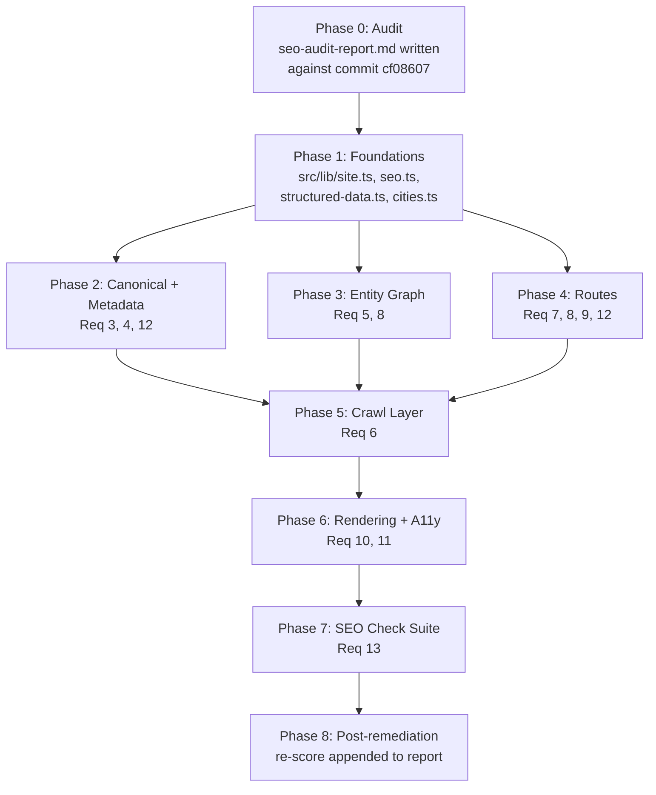
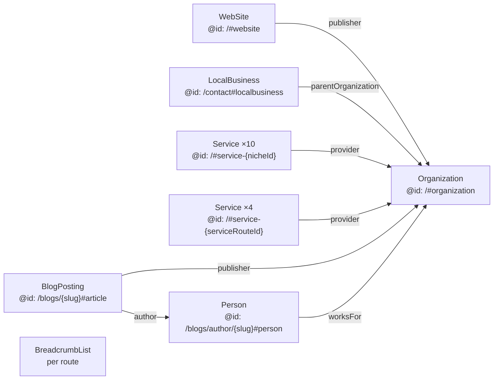
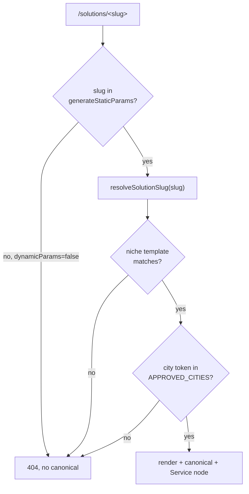

# Design Document

## Overview

This feature has two halves that must not be interleaved:

1. **The audit** — a written, evidence-bound report at `.kiro/specs/seo-audit-and-optimization/seo-audit-report.md` scoring the site against a ten-category weighted rubric, with every Finding traced to a repository file path.
2. **The remediation** — concrete changes to the existing Next.js 15 App Router application so the site is crawlable, canonicalised, entity-declared, AI-discoverable, accessible, fast, and protected by an automated SEO check suite.

The audit is a *snapshot deliverable*. Requirement 1 criterion 1 makes it a hard gate: the report is written and committed against the audited commit (`cf08607b59cdab4effde2131e756faa2f78e0232`, working tree carrying untracked `.kiro/`) **before** any remediation lands. Otherwise the report describes code that no longer exists, and Requirement 1 criterion 5 (every Finding cites a path in the audited commit) becomes unverifiable. The post-remediation re-score is appended last, under its own heading, leaving the pre-remediation numbers byte-identical.

### Design posture

The codebase already has a competent SEO surface: `metadataBase` and a title template, per-post `generateMetadata` with canonical and robots, three JSON-LD builders in `src/lib/blog.ts`, a dynamic sitemap, a `LIVE_POST_FILTER` that keeps drafts and `noindex` posts out of listings, and legacy WordPress redirects. So this design is **not** a greenfield SEO layer. It is:

- **Extraction** of values that are currently duplicated as literals (`https://blogspage.com` appears in `layout.tsx`, `sitemap.ts`, `robots.ts`, `blog.ts`, `solutions/[slug]/page.tsx`; the NAP appears in `contact/page.tsx`, `privacy/page.tsx`, `terms/page.tsx`) into single sources of truth, because several acceptance criteria demand *character-for-character* identity across surfaces (5.2, 5.4, 8.5).
- **Bounding** of things that are currently unbounded (`getNicheBySlug` accepting any city token).
- **Addition** of the route inventory the existing code already links to or claims exists (`/blogs/author/<slug>` is emitted in article JSON-LD today but 404s; `/solutions` is linked as `/#solutions`).
- **Relocation** of content from client-only render paths into server-rendered HTML (hero `<h1>`, preloader, cursor, smooth-scroll wrapper).

### What is explicitly out of scope

Off-site work (link acquisition, directory listings), Search Console configuration, and Lighthouse CI hosting. Requirement 11 criteria 4–7 state lab thresholds; this design specifies how to measure them locally and records the numbers in the report, but does not add a CI performance budget gate.

---

## Architecture

### Phase sequencing



Two ordering constraints are non-negotiable:

- **Audit precedes remediation** (Req 1.1). Phase 0 finishes and is committed before Phase 1 starts.
- **Re-score comes last** (Req 1.11, 1.14). The post-remediation section is appended only after Phase 7, because its Category_Scores must reflect the shipped state, and any Finding still open has to be listed with its reason.

Within remediation, Phase 1 must precede everything: `src/lib/site.ts` is the shared dependency that makes the identity requirements (5.2 `sameAs` matching the footer, 5.4 `LocalBusiness` matching the rendered NAP, 8.5 NAP identical across four surfaces) structurally true rather than manually kept in sync.

### Module map

New modules are grouped so that each acceptance-criteria cluster has one obvious owner.

| Module | Responsibility | Requirements |
|---|---|---|
| `src/lib/site.ts` | Single source of truth: `SITE_URL`, `SITE_NAME`, `NAP`, `SOCIAL_PROFILES`, `OPENING_HOURS`, `FOUNDING_YEAR`, `LOCALE` | 4.6, 5.1–5.4, 8.4, 8.5 |
| `src/lib/rubric.ts` | `RUBRIC` (ten weighted categories with anchors), `computeOverallScore`, `rankByPointsLost` — the report's arithmetic as code | 2.1–2.4, 2.6, 2.9 |
| `src/lib/seo.ts` | `canonicalUrl()`, `buildMetadata()`, `ogImageUrl()` — the only place `Metadata` objects are assembled | 3.1, 3.2, 4.3–4.6, 4.8, 12.5 |
| `src/lib/structured-data.ts` | `@id` minting + node builders for `Organization`, `WebSite`, `LocalBusiness`, `Service`, `Person`, `BreadcrumbList` | 5.1–5.12, 8.2 |
| `src/lib/cities.ts` | `APPROVED_CITIES` (the Approved_City_List) with token + display name | 3.3–3.6, 12.7 |
| `src/lib/keyword-map.ts` | Route → primary keyword phrase, consumed by `buildMetadata` and by the audit report | 12.1, 12.2, 12.5, 12.6 |
| `src/lib/heading-slug.ts` | `slugifyHeading()` and `createHeadingSlugger()` — pure, deterministic heading `id` derivation | 9.5 |
| `src/lib/routes.ts` | Route registry: static route descriptors + generators, consumed by sitemap, `/llms.txt`, nav, footer | 6.1, 6.2, 7.1, 9.2 |
| `src/lib/service-routes.ts` | The four dedicated Service_Route definitions | 12.3, 12.10 |
| `src/lib/sanity-image.ts` | `parseSanityImageRef()` → intrinsic width/height for body images | 11.2 |
| `src/components/seo/json-ld.tsx` | Server component rendering one `<script type="application/ld+json">` per node | 5.8, 13.2 |
| `src/components/layout/skip-link.tsx` | Skip-to-content anchor | 10.6–10.8 |
| `scripts/gen-route-lastmod.mjs` | Prebuild step writing git commit dates for source-backed routes | 6.3 |
| `tests/seo/**`, `tests/properties/**` | SEO check suite and property tests | 13.1–13.11 |

Existing modules change as follows. `src/lib/blog.ts` keeps its exported surface (`SITE_URL`, `SITE_NAME`, `postUrl`, `resolveDescription`, `buildArticleJsonLd`, `buildBreadcrumbJsonLd`, `buildFaqJsonLd`) so no call site breaks, but re-exports `SITE_URL`/`SITE_NAME` from `src/lib/site.ts` and delegates node construction to `src/lib/structured-data.ts`. `src/lib/niches.ts` keeps `NICHES`, `slugify`, `nicheSlug`, and `getNicheBySlug`, with `getNicheBySlug` gaining the city allow-list check and `allNicheParams` gaining the catalog × approved-city cross product.

### Route inventory

Routes marked **new** are added by this feature.

| Route | Source file | Indexable | In sitemap |
|---|---|---|---|
| `/` | `src/app/(site)/page.tsx` | yes | yes |
| `/about` | `src/app/(site)/about/page.tsx` **new** | yes | yes |
| `/blogs` | `src/app/(site)/blogs/page.tsx` | yes | yes |
| `/blogs/page/<N>` | `src/app/(site)/blogs/page/[page]/page.tsx` **new** | yes | yes |
| `/blogs/<slug>` | `src/app/(site)/blogs/[slug]/page.tsx` | unless `noindex` | unless `noindex` |
| `/blogs/category/<slug>` | `src/app/(site)/blogs/category/[slug]/page.tsx` **new** | yes | yes |
| `/blogs/category/<slug>/page/<N>` | `.../[slug]/page/[page]/page.tsx` **new** | yes | yes |
| `/blogs/author/<slug>` | `src/app/(site)/blogs/author/[slug]/page.tsx` **new** | yes | yes |
| `/blogs/author/<slug>/page/<N>` | `.../[slug]/page/[page]/page.tsx` **new** | yes | yes |
| `/solutions` | `src/app/(site)/solutions/page.tsx` **new** | yes | yes |
| `/solutions/<niche>-at-<city>` | `src/app/(site)/solutions/[slug]/page.tsx` | only approved cities | approved only |
| `/services/<slug>` ×4 | `src/app/(site)/services/[slug]/page.tsx` **new** | yes | yes |
| `/contact`, `/privacy`, `/terms` | existing | yes | yes |
| `/llms.txt` | `src/app/llms.txt/route.ts` **new** | n/a (text) | no |
| `/services.json` | `src/app/services.json/route.ts` **new** | n/a (JSON) | no |
| `/feed.xml` | `src/app/feed.xml/route.ts` **new** | n/a (XML) | no |
| `/og` | `src/app/og/route.tsx` **new** | n/a (image) | no |
| `/studio/**` | existing | **no** — `noindex` | no |

The author route path is forced, not chosen: `buildArticleJsonLd` in `src/lib/blog.ts` already emits `${SITE_URL}/blogs/author/${post.author.slug}`. Requirement 8.9 requires the rendered link and the `Person.url` to be the same absolute URL, and Requirement 5.7 requires every JSON-LD URL denoting a site route to return 200. Building the route at `/blogs/author/<slug>` satisfies all three without touching an emitted URL that may already be indexed.

**Redirect-exclusion hazard.** `next.config.ts` currently catches every unmatched root path and redirects it to `/blogs/:slug`, excluding only `blogs|studio|solutions|contact|privacy|terms|api|_next|favicon\.ico|robots\.txt|sitemap\.xml`. Every new root-level route (`about`, `services`, `og`, `llms.txt`, `services.json`, `feed.xml`) must be added to that negative lookahead or it will 308 into a non-existent blog post. This is the single highest-risk edit in the feature.

**Static-segment shadowing.** `/blogs/category/*`, `/blogs/author/*`, and `/blogs/page/*` are static segments that win over `/blogs/[slug]`. A post slugged `category`, `author`, or `page` becomes unreachable. `postType` gains a slug validation rule rejecting those three reserved values.

### Entity graph



Two decisions worth stating explicitly.

**`@id` minting.** All `@id` values are minted by one function, `mintId(path, fragment)`, returning `` `${SITE_URL}${path}#${fragment}` `` with `path` empty for the root. Node identity is deliberately **not** derived from the route currently being rendered:

- `Organization` → `https://blogspage.com/#organization`
- `WebSite` → `https://blogspage.com/#website`
- `LocalBusiness` → `https://blogspage.com/contact#localbusiness`
- `Service` → `https://blogspage.com/#service-<catalogId>`
- `Person` → `https://blogspage.com/blogs/author/<slug>#person`
- `BlogPosting` → `https://blogspage.com/blogs/<slug>#article` (unchanged from today)

Requirement 5.10 requires an `@id` to be identical for a node across every route it appears on and across rebuilds of unchanged content. The `Organization` node appears on every indexable route and the `Service` nodes appear on both `/solutions` and each `/solutions/<slug>`, so their identity has to be route-independent. Anchoring `Service` at the root (`/#service-<id>`) rather than at a city route keeps the same node identity whether the service is rendered on the hub or on the Hyderabad page. City variation is carried by the route-local `areaServed` property and by the node's `url`, both of which point at the route being rendered — the requirement constrains `@id` stability, not full node equality.

**One `<script>` per node, not `@graph`.** A `@graph` wrapper is the more idiomatic way to publish an interlinked graph, but Requirement 5.8 and Requirement 13.2 both require every emitted JSON-LD block to declare a `@type`, and a `@graph` envelope has no top-level `@type`. So the site emits sibling blocks, each with its own `@context` and `@type`, connected by `@id` references. This also matches what `blogs/[slug]/page.tsx` already does (three separate scripts) and keeps the check-suite assertion trivially satisfiable. `<JsonLd nodes={[...]} />` renders the array.

### Solutions slug resolution



`generateStaticParams` returns the cross product of the ten Service_Catalog entries and `APPROVED_CITIES`. With `export const dynamicParams = false`, Next.js returns 404 for any slug outside that set at the routing layer, before the page module runs — that is where the 404 for an unapproved city token is raised (Req 3.5, 3.6). The in-page `notFound()` call and the null-guard in `generateMetadata` stay as defence in depth for the dev server and for any future move to on-demand rendering. `generateMetadata` returns `{ title, robots: { index: false, follow: false } }` with **no** `alternates.canonical` when resolution fails, satisfying "SHALL NOT emit an `alternates.canonical` URL for that request".

The Approved_City_List ships with a single token, `hyderabad`, matching the current `DEFAULT_CITY` and the published NAP. Requirement 3.3 permits 1–50. Starting at one keeps the ten solution pages substantive; each added city multiplies the route count by ten and, without city-specific copy, produces doorway pages that Requirement 12.7 (city name in `<h1>`, meta description, and twice in body) only partially defends against. Expansion is a content decision, and the design records it as one: adding a token to `APPROVED_CITIES` is mechanically sufficient but editorially insufficient.

### Rendering strategy changes

Requirement 11.1 and Requirement 9.7 together mean the largest text on the homepage and the whole of post/solution body content must be readable in the HTML response with JavaScript disabled. Four client components stand in the way.

| Component | Current problem | Change |
|---|---|---|
| `src/components/home/hero.tsx` | `wordReveal.hidden` sets `opacity: 0, y: 100%, rotateX: -55`; Framer Motion serialises `initial` into inline styles during SSR, so the `<h1>` ships invisible | Split into a server `Hero` that renders the `<h1>` as plain text plus the 40–80 word AI-summary paragraph, and a client `HeroAmbient` for the breathing gradients and trust strip. The word reveal moves from Framer Motion to a CSS keyframe stagger in `globals.css` driven by a `--word-index` custom property, with `animation-fill-mode: both` and a `prefers-reduced-motion` short-circuit. CSS animations need no JS, so the reveal survives with scripting off and the text is at `opacity: 1` in the served HTML. |
| `src/components/ui/preloader.tsx` | Renders nothing on the server (good) but runs 1600 ms + 300 ms after hydration, exceeding the 1500 ms budget | Cut the counter to 900 ms with a 150 ms hold, add a hard `setTimeout` release, skip entirely under `prefers-reduced-motion`, and mark the overlay `aria-hidden`. Main content already stays in the document behind it. |
| `src/components/providers/smooth-scroll-provider.tsx` | Wraps `<main>`, so all page content sits inside a client boundary | Stop wrapping. Lenis drives document scroll and needs no wrapper element, so it becomes a sibling side-effect component `<SmoothScroll />` rendered after `<Footer />`. `<main>` and its children return to the server tree. |
| `src/components/ui/custom-cursor.tsx` | Client-only, mounted eagerly | Mount from a single `<ClientEnhancements />` sibling that defers to `requestIdleCallback`. Already returns `null` on coarse pointers. |

Visual output is unchanged in all four cases: the hero reveal keeps the same offsets, easing, and stagger, expressed in CSS instead of JS; the preloader keeps its counter and exit spring on a shorter clock; Lenis and the cursor behave identically because neither depends on wrapping the tree.

### Social preview images

Generated on demand by a Next.js `ImageResponse` route rather than committed as static assets, because Requirement 4.10 requires unique titles and descriptions per route and Requirement 4.7 requires the image to render the route's own title. Hand-authoring one PNG per route (10 solutions + 4 services + archives + every post) does not scale.

- `src/app/og/route.tsx` — `import { ImageResponse } from "next/og"` (ships with Next 15, no new dependency), `runtime = "edge"`, size 1200×630, reading `?title=` and `?eyebrow=`. Fonts are loaded from a local subset committed under `src/app/og/fonts/` — never fetched from a remote host, which is the usual cause of blowing the 2-second budget.
- Failure and timeout path: the handler wraps generation in `try/catch` plus a `Promise.race` against a 1800 ms timer and, on either branch, responds `302` to `/og-default.png`, a committed 1200×630 static asset in `public/`. That asset is also the static fallback referenced by Requirement 4.9 and it replaces the currently-referenced-but-absent `/og-image.png`.
- `ogImageUrl({ title, eyebrow })` in `src/lib/seo.ts` is the only caller; it returns an absolute URL so Requirement 4.1 holds for every consumer. Posts keep their author-supplied `ogImageUrl` from Sanity when present and fall back to the generated URL otherwise.

### Crawl layer

`src/app/sitemap.ts` is rewritten to compose from `src/lib/routes.ts` rather than an inline literal array, so the route inventory has one owner. Requirement 6.3 forbids deriving `lastModified` from request time — the current implementation uses `new Date()` for every static route, which makes two consecutive fetches differ. Replacement: a prebuild script `scripts/gen-route-lastmod.mjs` runs `git log -1 --format=%cI -- <file>` per source-backed route and writes `src/lib/route-lastmod.generated.json`; content-backed routes keep deriving from `lastReviewed || _updatedAt || publishedAt`. The Sanity fetch is wrapped so a failure yields the static route set at HTTP 200 (Req 6.12) instead of a 500.

`src/app/robots.ts` gains six named user-agent records (`GPTBot`, `OAI-SearchBot`, `ChatGPT-User`, `ClaudeBot`, `PerplexityBot`, `Google-Extended`) alongside `*`, each allowing `/` and disallowing `/studio`. `robots.txt` alone does not produce a `noindex`, so `src/app/studio/layout.tsx` also exports `metadata.robots = { index: false, follow: false }`, which App Router inherits down every nested `/studio` path (Req 3.7).

`/feed.xml` serves RSS 2.0 for the 20 most recent live posts, reusing `LIVE_POST_FILTER`, and is referenced from `/blogs` via `alternates.types["application/rss+xml"]`. Both the sitemap and the feed export `revalidate = 3600`, which is what satisfies the 3600-second propagation windows in Requirements 6.10 and 6.11.

### Security headers and image configuration

All in `next.config.ts`:

- `async headers()` returning, for source `/(.*)`: `Strict-Transport-Security: max-age=31536000; includeSubDomains`, `X-Content-Type-Options: nosniff`, `Referrer-Policy: strict-origin-when-cross-origin` (Req 11.10).
- `images.formats: ["image/avif", "image/webp"]` (Req 11.3).
- `dangerouslyAllowSVG` flips to `false` (Req 11.11). The only SVG consumers are four local placeholders in `src/components/solutions/gym-solution-landing.tsx`; they are converted to inline React SVG components under `src/components/solutions/placeholders/`, which removes them from the image pipeline entirely rather than trading one unsafe flag for a sanitiser.

---

## Components and Interfaces

### `src/lib/site.ts` — identity source of truth

```ts
export const SITE_URL = "https://blogspage.com";
export const SITE_NAME = "Blogspage";
export const LOCALE = { openGraph: "en_IN", html: "en-IN" } as const;
export const FOUNDING_YEAR = 2024;

export const NAP = {
  legalName: "Blogspage",
  streetAddress: "Ayodhya Nagar Colony, Mehdipatnam",
  locality: "Hyderabad",
  region: "Telangana",
  postalCode: "500028",
  country: "India",
  countryCode: "IN",
  telephone: "+91 80194 43314",
  telephoneHref: "tel:+918019443314",
  email: "ravi@blogspage.com",
} as const;

export const OPENING_HOURS = "Mo-Su 10:00-19:00";

export const SOCIAL_PROFILES = [
  { label: "X (Twitter)", href: "https://x.com/ravindra5k" },
  { label: "GitHub", href: "https://github.com/RaviBuilds" },
  { label: "LinkedIn", href: "https://www.linkedin.com/in/ravindra-kamble-97094220a/" },
] as const;
```

`src/components/layout/footer.tsx` drops its local `socialLinks` array and maps `SOCIAL_PROFILES` (keeping the icon lookup local, since icons are not data). `contact/page.tsx`, `privacy/page.tsx`, and `terms/page.tsx` render their address blocks from `NAP`. That is what makes Requirement 5.2 and Requirement 8.5 character-identity claims hold by construction rather than by vigilance.

Requirement 5.4 asks for `openingHours` covering all seven days while `/contact` currently renders "Mon–Sat, 10:00 AM – 7:00 PM IST". These disagree, and structured data that contradicts the page is worse than absent. Resolution: `/contact` renders hours from `OPENING_HOURS` (`Mo-Su 10:00-19:00`, displayed as "Mon–Sun, 10:00 AM – 7:00 PM IST"), so page and markup agree. If seven-day availability is wrong as a business fact, the constant changes and both surfaces follow.

### `src/lib/seo.ts` — metadata factory

```ts
export function canonicalUrl(path: string): string;
export function ogImageUrl(input: { title: string; eyebrow?: string }): string;

export type BuildMetadataInput = {
  path: string;                 // "/", "/blogs", "/solutions/<slug>"
  title: string;                // pre-template; must contain the keyword phrase
  description: string;          // 120–160 chars
  image?: { url: string; alt: string };
  type?: "website" | "article";
  index?: boolean;              // default true
  extra?: Metadata;             // per-route additions (authors, publishedTime, feed alternate)
};

export function buildMetadata(input: BuildMetadataInput): Metadata;
```

`canonicalUrl` normalises to `https`, `blogspage.com`, lowercase path, no query, no fragment, no trailing slash, and returns bare `https://blogspage.com` for `/` (Req 3.2). `buildMetadata` emits `alternates.canonical`, the full `openGraph` block with `locale: "en_IN"`, `url`, and an image carrying non-empty `alt`, and the `twitter` block with `card: "summary_large_image"` (Req 4.3). Description falls back to an `ogImageUrl`-generated preview when no image is supplied.

Length bounds (title 30–70, description 120–160) are enforced in two places: a `dev`-only `console.error` inside `buildMetadata` for fast feedback, and the check suite for authority. `resolveDescription` in `src/lib/blog.ts` gains a `clampDescription` step that truncates body-derived text at a word boundary inside the 120–160 window (Req 4.11); posts whose excerpt is shorter than 120 characters are padded from body text rather than shipped short.

Every route module that currently hand-rolls a `Metadata` object — `src/app/layout.tsx`, `blogs/page.tsx`, `blogs/[slug]/page.tsx`, `solutions/[slug]/page.tsx`, `contact/page.tsx`, `privacy/page.tsx`, `terms/page.tsx` — is converted to call `buildMetadata`. The root `layout.tsx` keeps `metadataBase` and the title template, drops its broken `/og-image.png` reference, and sets `<html lang="en-IN">`.

### `src/lib/structured-data.ts` — entity graph builders

```ts
export function mintId(path: string, fragment: string): string;

export function organizationNode(): JsonLdNode;                        // @id /#organization
export function webSiteNode(): JsonLdNode;                             // @id /#website, publisher → org
export function localBusinessNode(): JsonLdNode;                       // @id /contact#localbusiness
export function serviceNode(entry: ServiceCatalogEntry, opts?: { areaServed?: string[]; url?: string }): JsonLdNode;
export function personNode(author: AuthorProfile): JsonLdNode;         // @id /blogs/author/<slug>#person
export function breadcrumbNode(trail: BreadcrumbItem[]): JsonLdNode;
export function faqNode(pairs: FaqItem[]): JsonLdNode | null;

export function omitEmpty<T extends object>(node: T): T;               // Req 5.12
```

`omitEmpty` recursively strips properties whose value is `undefined`, `null`, `""`, or an empty array, so Requirement 5.12 ("omit rather than emit an empty, null, or placeholder value") is a property of the builder rather than of each call site. The existing `...(x && { x })` spreads in `buildArticleJsonLd` are replaced by plain assignment plus `omitEmpty`, which is equivalent but far harder to get wrong as the node grows.

`buildBreadcrumbJsonLd` in `src/lib/blog.ts` is generalised into `breadcrumbNode(trail)` so every route below the root can use it (Req 5.6) instead of only posts, and the same trail data drives the visible breadcrumb component (Req 7.4) — one array, two renderings, so the visible trail and the markup cannot drift.

The existing `ProfessionalService` block in `solutions/[slug]/page.tsx` is replaced by `serviceNode(...)` plus `organizationNode()` and `breadcrumbNode(...)`. Requirement 5.5 names `Service` specifically, and the current node's inline `provider: { "@type": "Organization", ... }` is an anonymous duplicate of the site's Organization rather than a reference to it, which is exactly the disconnection Requirement 5.10 forbids.

### `src/lib/cities.ts` and the solutions resolver

```ts
export type ApprovedCity = { token: string; displayName: string };
export const APPROVED_CITIES: readonly ApprovedCity[] = [
  { token: "hyderabad", displayName: "Hyderabad" },
];
export function findApprovedCity(token: string): ApprovedCity | null;   // lowercases input
```

`displayName` exists because `titleCase` on a hyphenated token produces "Navi Mumbai" correctly but "Bengaluru" style exceptions and casing like "New Delhi" are data, not an algorithm. Requirement 12.7 requires the *display name* in the `<h1>`, the meta description, and twice in body text, so the label has to be authoritative. `titleCase` is removed from `solutions/[slug]/page.tsx` and `solution-template.tsx` in favour of `city.displayName`.

In `src/lib/niches.ts`:

```ts
export type SolutionMatch = { niche: Niche; city: ApprovedCity };
export function resolveSolutionSlug(slug: string): SolutionMatch | null;  // pure
export function getNicheBySlug(slug: string): SolutionMatch | null;       // alias, back-compat
export function allNicheParams(): { slug: string }[];                     // catalog × APPROVED_CITIES
```

`resolveSolutionSlug` is pure and total: string in, match or `null` out, no I/O, no throw. It is the primary property-test target alongside `slugifyHeading`. Its niche-template matching keeps the existing regex-from-template approach, with the city capture group narrowed to `[a-z0-9-]+` and the captured token then checked against `findApprovedCity`.

### `src/lib/heading-slug.ts`

```ts
export function slugifyHeading(text: string): string;
export function createHeadingSlugger(): (text: string) => string;
```

`slugifyHeading` lowercases, strips accents via `normalize("NFKD")`, removes anything outside `[a-z0-9\s-]`, collapses whitespace runs to single hyphens, collapses hyphen runs, trims leading and trailing hyphens, and returns `"section"` when the result is empty (so headings consisting only of punctuation or CJK still get a valid, non-empty `id`). `createHeadingSlugger` closes over a `Map<string, number>` and appends `-2`, `-3`, … to the second and later occurrences of a base slug, so ids are unique within a route (Req 9.5) while the first occurrence keeps the clean form.

Wiring: the PortableText `block` components in `blogs/[slug]/page.tsx` gain `h2`/`h3` renderers that pull ids from a per-render slugger instance; `solution-template.tsx`, the service template, and the FAQ sections do the same from their heading data. One slugger per rendered route, created at the top of the page component, so numbering is route-scoped and deterministic under a fixed heading sequence.

### New route components

**`/solutions` hub** renders the ten Service_Catalog entries, each linking to `/solutions/<nicheSlug(niche, city)>` for every approved city (Req 7.1 — exactly those anchors, no others), ten `Service` nodes, an `Organization` node, and a breadcrumb. It replaces every `/#solutions` anchor: `footer.tsx` (Company → Solutions), `solution-hero.tsx` ("View all solutions"), and the navbar, which gains a Solutions entry (Req 7.2).

**`/services/[slug]`** is driven by `src/lib/service-routes.ts`:

```ts
export type ServiceRoute = {
  id: "ai-automation" | "ai-sales-agents" | "custom-saas-development" | "programmatic-seo";
  slug: string;
  h1: string;              // contains the primary keyword phrase verbatim (Req 12.3)
  keywordPhrase: string;
  metaDescription: string; // 120–160 chars
  summary: string;         // 40–80 words, server-rendered
  sections: { heading: string; body: string }[];
  faq: FaqItem[];          // ≥3 pairs
};
```

These four routes exist because Requirement 12.3 names them and because the footer already advertises "AI Sales Agents", "Workflow Automation", "Custom SaaS", and "Programmatic SEO" as links to `/#services` — an anchor, not a page. They are linked from the navbar and footer (Req 12.10) and listed in the sitemap.

**Blog archives and pagination** share one `PostListing` component (grid, 12 per page, `publishedAt desc`) and one `Pagination` component rendering every page target as a real `<a href>` so the set is crawlable (Req 7.7). New GROQ queries in `src/sanity/lib/queries.ts`, all built on `LIVE_POST_FILTER`:

```ts
export const POSTS_PAGE_QUERY;              // $start, $end + total count
export const CATEGORY_POSTS_QUERY;          // $slug, $start, $end
export const AUTHOR_POSTS_QUERY;            // $slug, $start, $end
export const CATEGORY_SLUGS_QUERY;          // categories with ≥1 live post
export const AUTHOR_SLUGS_QUERY;            // authors with ≥1 live post
export const AUTHOR_PROFILE_QUERY;          // name, jobTitle, bio, sameAs, imageUrl
export const FEED_POSTS_QUERY;              // 20 most recent, noindex excluded
```

`CATEGORY_SLUGS_QUERY` and `AUTHOR_SLUGS_QUERY` filter on "referenced by at least one published post" (Req 7.5, 7.6, 8.8) so empty taxonomy terms never become thin indexable pages. Page numbers outside `1..totalPages`, non-integer page numbers, and unknown slugs all `notFound()` (Req 7.9, 7.10).

**`/blogs/author/[slug]`** renders name, job title, bio, and the author's posts, omitting missing fields with no placeholder text (Req 8.10), and emits a `Person` node whose `url` equals the route's own absolute URL. Post pages gain a byline link to it using that same URL (Req 8.9).

**`/about`** states the founding year from `FOUNDING_YEAR`, at least three named service categories from the Service_Catalog, at least two delivery models sourced from the existing `delivery-models.tsx` data, and at least three case references. The case references reuse the four real projects in `featured-work.tsx` (Phixl AI, NextInn, ArogyaDiet, Best100Movies); each needs a metric with a name, numeric value, and unit, plus the literal word "measured" or "estimated" in the same visible block (Req 8.6, 8.7). Today those cards carry narrative outcomes without figures, so this is a copy task with a hard shape, and unlabelled numbers are not permitted.

### AI discovery layer

`src/app/llms.txt/route.ts` returns `text/plain; charset=utf-8`, composed from `SITE_NAME`, a one-sentence 15–30 word description, all ten Service_Catalog entries, and the absolute URLs of `/`, `/blogs`, `/solutions`, `/contact`, `/privacy`, `/terms` (Req 9.2). `src/app/services.json/route.ts` returns `application/json` with one entry per catalog entry: `name`, a 15–40 word `description`, and the absolute target URL. Both read from `SERVICE_CATALOG` and `src/lib/routes.ts`, so Requirement 9.10 (a catalog change is reflected on the first request after deploy) follows from having no separate copy of the data. Both are `dynamic = "force-static"` with `revalidate = false`: content changes only when code changes, so a redeploy is the invalidation event.

### Accessibility surface

`src/app/(site)/layout.tsx` becomes:

```tsx
<SkipLink />                               {/* first focusable, href="#main" */}
<Navbar />
<main id="main" tabIndex={-1} className="min-h-screen">{children}</main>
<Footer />
<ClientEnhancements />                     {/* CustomCursor + SmoothScroll + ChatWidget */}
<Preloader />
```

`blogs/page.tsx` drops its inner `<main>` (currently nested inside the layout's `<main>`) and returns a fragment (Req 10.1). `tabIndex={-1}` on `<main>` is what makes the skip link actually move focus rather than only move the scroll position (Req 10.8). `SkipLink` uses the standard visually-hidden-until-focused pattern with a focus ring meeting 3:1 contrast (Req 10.7).

Anchor accessible names: the footer's "Solutions"/"Contact"/"Blog" labels are fine; `solution-template.tsx`'s "Start a Project" and the navbar's icon-only controls already carry `aria-label`. The audit records any anchor whose accessible name is a generic phrase (Req 10.5) — the current tree has none, so this is a regression guard, not a fix.

### SEO check suite

```
tests/
  seo/
    global-setup.ts        # boots `next start` unless SEO_BASE_URL is set
    route-set.ts           # fetches + parses /sitemap.xml, adds "/"
    canonical.spec.ts      # Req 13.1
    json-ld.spec.ts        # Req 13.2
    social-images.spec.ts  # Req 13.3
    document.spec.ts       # Req 13.4, 13.5, 13.11
    crawl-files.spec.ts    # Req 13.6
  properties/
    heading-slug.spec.ts
    solution-slug.spec.ts
    canonical.spec.ts
    entity-graph.spec.ts
```

Runner: **Vitest** plus **fast-check** for properties, parsing HTML with **jsdom**, which is already a project dependency (`jsdom@^29`, `@types/jsdom`). Vitest is chosen over Jest because the project is ESM + TypeScript with path aliases and Vitest reads `tsconfig` paths without extra transform configuration; over Playwright because no assertion here needs a real browser — every check reads the server-rendered HTML, which is precisely the thing Requirements 9.7 and 11.1 care about.

Boot sequence, per Requirement 13.8: `globalSetup` reads `SEO_BASE_URL`. If set, it is used as-is (so the suite can run against a preview deployment). If not, the setup spawns `next start -p 3100`, polls `/` until it answers or 90 seconds elapse, exposes `http://localhost:3100`, and kills the child in teardown. The production build itself is the npm script's job, not the setup's:

```json
"scripts": {
  "test": "vitest run",
  "test:properties": "vitest run tests/properties",
  "seo:check": "next build && vitest run --config vitest.seo.config.ts"
}
```

Route-set derivation (Req 13.9): `route-set.ts` fetches `/sitemap.xml`, extracts `<loc>` values, converts them to paths, adds `/`, deduplicates, and asserts the set contains at least one `/blogs/<slug>` and one `/solutions/<slug>`. Deriving the set from the sitemap rather than from a hardcoded list means a route that ships without a sitemap entry is invisible to the suite — which is itself a defect the sitemap assertions catch, and it keeps the suite honest about what the site claims to publish.

Failure reporting (Req 13.7, 13.10): each spec collects violations into a structured array and asserts emptiness once at the end, so one bad route does not mask the rest. Every fetch uses `AbortSignal.timeout(30_000)`; a timeout is recorded as a failed assertion naming the route and the limit, and iteration continues. Requests run with a concurrency cap of 6 to stay inside the 10-minute budget (Req 13.8).

---

## Data Models

### Rubric and audit report

```ts
type RubricCategoryName =
  | "Crawlability and Indexation"
  | "Canonicalisation and Duplicate Control"
  | "Metadata and Social Previews"
  | "Structured Data and Entity Graph"
  | "Content and Keyword Architecture"
  | "Site Architecture and Internal Linking"
  | "Core Web Vitals and Rendering"
  | "Semantic HTML and Accessibility"
  | "Authority and E-E-A-T Signals"
  | "AI and LLM Discoverability";

type AnchorDescriptor = {
  score: 0 | 5 | 10;
  artefact: string;    // what to inspect: file, URL, or measurement
  threshold: string;   // what counts as met
};

type RubricCategory = {
  name: RubricCategoryName;
  weight: number;                  // integer 5..20; the ten sum to exactly 100
  anchors: [AnchorDescriptor, AnchorDescriptor, AnchorDescriptor];
};

type CategoryScore = {
  name: RubricCategoryName;
  weight: number;
  score: number;                   // 0..10, step 0.5
  contribution: number;            // weight * score / 100, 2 dp
  anchorUsed: 0 | 5 | 10;
  evidence: string;
  findingIds: string[];            // empty means "no Finding recorded"
  unmeasured?: { missingEvidence: string };
};
```

The ten weights (summing to 100), chosen to reflect what actually gates organic and AI visibility for a small agency site:

| Category | Weight |
|---|---|
| Crawlability and Indexation | 12 |
| Canonicalisation and Duplicate Control | 12 |
| Metadata and Social Previews | 10 |
| Structured Data and Entity Graph | 13 |
| Content and Keyword Architecture | 12 |
| Site Architecture and Internal Linking | 10 |
| Core Web Vitals and Rendering | 10 |
| Semantic HTML and Accessibility | 7 |
| Authority and E-E-A-T Signals | 8 |
| AI and LLM Discoverability | 6 |

Structured Data carries the largest weight because the agency entity is currently undeclared, which is the finding with the widest downstream effect: no `Organization`, no `sameAs`, no `LocalBusiness`, and a `provider` that duplicates rather than references. Semantic HTML and AI Discoverability sit lowest not because they are unimportant but because their defects are locally contained and cheap to fix.

The arithmetic lives in `src/lib/rubric.ts`, not in the author's head:

```ts
export const RUBRIC: readonly RubricCategory[];                    // ten categories, weights sum 100
export function computeOverallScore(scores: CategoryScore[]): number;      // half-up, 1 dp
export function computeContributions(scores: CategoryScore[]): CategoryScore[];  // 2 dp each
export function rankByPointsLost(scores: CategoryScore[]): CategoryScore[];      // desc, stable ties
```

`Overall_Score = round_half_up(Σ(score × weight) / 100, 1)` (Req 2.4). Putting this in a module rather than computing it by hand is what makes Requirements 2.4, 2.6, and 2.9 testable at all: half-up rounding at `.05` boundaries, the two-decimal contribution sum staying within 0.05 of the unrounded score, and the points-lost ranking are all things floating-point arithmetic gets subtly wrong. The report's tables are generated from this module's output, so the displayed numbers and the stated score cannot disagree.

Ties in `rankByPointsLost` are broken by descending weight, then by category name, so the ranking is a total order and the "highest three" (Req 2.9) is well defined even when several categories lose identical points.

```ts
type Finding = {
  id: string;                      // stable, e.g. "F-01"
  severity: "critical" | "high" | "medium" | "low";
  category: RubricCategoryName;    // exactly one
  title: string;
  filePaths: string[];             // ≥1, must exist in the audited commit
  consequence: string;             // ≥1 observable crawl/index/rank/render effect
  needsLiveVerification?: { observationNeeded: string };
  remediationRequirement: string;  // e.g. "Req 5.1"
};
```

Severity is assigned by the rules in Requirement 1.12, not by judgement. Applying them to the grounded scan:

| Finding | Severity | Rule applied |
|---|---|---|
| Unbounded city token in `getNicheBySlug` | `critical` | exposes an unbounded set of duplicate indexable routes |
| `/og-image.png` referenced but absent | `high` | indexable route resolves to a broken referenced asset |
| No canonical on `/`, `/contact`, `/privacy`, `/terms` | `high` | omits a canonical URL |
| Solution pages absent from `sitemap.xml` | `high` | indexable route absent from the crawl layer |
| `/blogs/author/<slug>` emitted in JSON-LD but 404 | `high` | structured data references a non-200 route |
| No `Organization` / `WebSite` / `LocalBusiness` | `medium` | signal absent, no route made unreachable |
| Nested `<main>` on `/blogs` | `medium` | signal present but inconsistent across routes |
| `en_US` locale against an India NAP | `medium` | inconsistent signal |
| Hero `<h1>` at `opacity: 0` in server HTML | `medium` | rendering degraded, route still indexable |
| Raw `` for article body images | `medium` | rendering, CLS |
| No `llms.txt`, no AI-crawler records, no feed | `medium` | discovery signal absent |
| No `formats` preference, no security headers | `low` | no change to indexation outcome |
| `dangerouslyAllowSVG: true` | `low` | security posture, not an indexation outcome |

`/solutions` having no hub page is recorded as `high` (an intended indexable route is absent from the crawl layer entirely, and three anchors point at an anchor instead). Category and author archives absent is `medium` — no existing route is broken; the surface simply does not exist yet.

The backlog orders all Findings `critical → high → medium → low`, each entry naming the Finding id it resolves (Req 1.7).

### Keyword map

```ts
type KeywordAssignment = {
  path: string;                    // route path
  absoluteUrl: string;             // canonicalUrl(path)
  phrase: string;                  // 2..8 words, ≤60 chars, unique case-insensitively
  serviceCatalogId?: string;       // set for the routes that target a catalog entry
};
export const KEYWORD_MAP: readonly KeywordAssignment[];
```

Uniqueness (Req 12.6) and title containment (Req 12.5) are checked in the property suite by comparing `KEYWORD_MAP` against the metadata each route emits. The map lives in code rather than only in the report so that `buildMetadata` can read it and so the check suite has a machine-readable expectation.

### JSON-LD node shape

```ts
type JsonLdNode = {
  "@context": "https://schema.org";
  "@type": string;
  "@id"?: string;
} & Record<string, unknown>;

type NodeRef = { "@id": string };
```

Every node carries its own `@context` and `@type` (per the one-script-per-node decision). References are `NodeRef` objects, and the graph-connectivity property asserts that every `@id` referenced on a route resolves to a node emitted on that same route (Req 5.10).

### Check-suite result shape

```ts
type Violation = {
  target: string;        // route path or file path
  assertion: string;     // named assertion, e.g. "canonical-self-reference"
  expected: string;
  observed: string;
};
```

Requirement 13.7 names all four fields; making them a type rather than a message string is what keeps the failure output machine-readable and the reporting uniform across specs.

---

## Correctness Properties

*A property is a characteristic or behavior that should hold true across all valid executions of a system — essentially, a formal statement about what the system should do. Properties serve as the bridge between human-readable specifications and machine-verifiable correctness guarantees.*

Three domains appear below. **Pure-function properties** (`computeOverallScore`, `canonicalUrl`, `slugifyHeading`, `createHeadingSlugger`, `resolveSolutionSlug`, `clampDescription`, `omitEmpty`, the date-comparison helper) are exercised with generated inputs from `fast-check` and are where property-based testing earns its keep. **Route-level properties** are universally quantified over the route set derived from `sitemap.xml` — a finite but build-dependent domain, checked exhaustively over that set, which is the property form available for a system whose input space is its own published route inventory. **Builder-level properties** sit between the two: they generate partially-populated content records and assert invariants of the emitted nodes without needing a server.

### Property 1: Rubric scoring is a correct weighted mean

*For any* vector of ten Category_Scores drawn from the 0.5-step range 0 to 10, `computeOverallScore` returns a value between 0.0 and 10.0 carrying exactly one decimal place that equals the sum of score times weight divided by 100 rounded half-up; the ten contributions each rounded to two decimals sum to within 0.05 of that value; and `rankByPointsLost` returns a permutation of the ten categories ordered by descending weight times the difference between 10 and score, whose first three elements are the categories named as the largest shortfall contributors.

**Validates: Requirements 2.4, 2.6, 2.9**

### Property 2: Canonical self-reference

*For any* route in the sitemap-derived route set, the route emits exactly one canonical `<link>` and exactly one `<title>`, and the canonical URL is character-for-character equal to that route's own absolute URL with the `https` scheme, the `blogspage.com` host, a lowercase path, no query string, no fragment, and no trailing slash.

**Validates: Requirements 3.1, 3.2, 4.8, 13.1**

### Property 3: Canonical normalisation is total and idempotent

*For any* string path, `canonicalUrl` returns a URL with the `https` scheme, the `blogspage.com` host, a lowercase path, no query, no fragment, and no trailing slash, returns the bare scheme and host for the root path, and satisfies `canonicalUrl(canonicalUrl(p)) === canonicalUrl(p)`.

**Validates: Requirements 3.2**

### Property 4: Sitemap membership excludes everything unindexable

*For any* route listed in `sitemap.xml`, that route responds with HTTP 200 without an intervening redirect and emits no `noindex` robots directive; and *for any* route that emits a `noindex` directive, that responds with a status other than 200, that lies beneath `/studio`, or whose city token is absent from the Approved_City_List, no `sitemap.xml` entry has that route's URL as its location.

**Validates: Requirements 3.9, 3.10, 6.1, 6.4**

### Property 5: Sitemap entries are unique and canonically formed

*For any* pair of entries in `sitemap.xml`, their location values differ; every location is an absolute `https://blogspage.com` URL with no trailing slash and no query parameters; every `lastModified` parses as an ISO 8601 timestamp with a UTC offset; and the entry count does not exceed 50,000.

**Validates: Requirements 6.1, 6.2, 6.3**

### Property 6: Sitemap lastModified is request-time independent

*For any* two generations of `sitemap.xml` separated by no content change, every entry's `lastModified` value is byte-identical between the two generations.

**Validates: Requirements 6.3**

### Property 7: Feed items are well formed and exclude hidden posts

*For any* item in the feed, the item carries a title, an absolute item URL, a publication date, and a summary of 500 characters or fewer; the feed carries at most 20 items; and no item corresponds to a post excluded from `sitemap.xml`.

**Validates: Requirements 6.7**

### Property 8: JSON-LD parses and is typed

*For any* route in the route set and *for any* `application/ld+json` block in that route's HTML, the block parses as JSON without error and declares both a Schema.org `@context` and a `@type` whose value is a published Schema.org type name.

**Validates: Requirements 5.8, 13.2**

### Property 9: Entity graph is connected and node identity is stable

*For any* route in the route set, every `@id` referenced by a property of any node emitted on that route resolves to a node carrying that `@id` in the same route's JSON-LD; every `@id`, `url`, and `logo` value is an absolute `https://blogspage.com` URL, and every such value denoting a site route resolves to a route returning HTTP 200; and *for any* two routes that both emit a given `Organization`, `WebSite`, or `Service` node, that node's `@id` is identical on both and identical across two successive builds of unchanged content.

**Validates: Requirements 5.3, 5.5, 5.7, 5.10**

### Property 10: Structured-data builders never emit empty values

*For any* partially-populated content record, no property value anywhere in the emitted node tree is an empty string, an empty array, `null`, or `undefined`; every property whose source value is unavailable is absent rather than placeholder-valued; and the node's remaining properties are unaffected by the omission.

**Validates: Requirements 5.11, 5.12, 8.2, 8.10**

### Property 11: Organization and Service node cardinality and field bounds

*For any* indexable route, the route emits exactly one `Organization` node whose `description` is 50 to 300 characters and whose `logo` resolves to an asset returning HTTP 200; the `/solutions` hub emits exactly ten `Service` nodes, one per Service_Catalog entry; each `/solutions/<slug>` route emits exactly one `Service` node for its own service; and every `Service` node carries a name identical to its catalog entry, a `description` of 50 to 300 characters, a `serviceType`, and a `provider` reference to the `Organization` node's `@id`.

**Validates: Requirements 5.1, 5.5**

### Property 12: Published identity matches rendered identity

*For any* route emitting the `Organization` node, its `sameAs` array contains exactly three absolute URLs character-for-character identical to the X, GitHub, and LinkedIn hrefs rendered in the site footer; and *for any* of `/contact`, `/privacy`, `/terms`, and the `LocalBusiness` node, the business name, street address line, locality, region, postal code, country, and contact point are character-for-character identical, ignoring line breaks and surrounding whitespace.

**Validates: Requirements 5.2, 5.4, 8.5**

### Property 13: Breadcrumb trails are contiguous and doubly rendered

*For any* route below the site root, the route emits exactly one `BreadcrumbList` whose items begin at `position` 1 with the site root and increase by exactly 1 with no gaps, whose ancestor items reference routes returning HTTP 200, and whose final item names the current route; and the visible breadcrumb trail renders the same item sequence in the same order with the first item linked to `/` and the final item as text without an anchor.

**Validates: Requirements 5.6, 7.4**

### Property 14: FAQ structured data matches rendered text

*For any* route that emits a `FAQPage` node, each question and answer in the node is character-for-character identical, ignoring leading and trailing whitespace, to a question and answer rendered in that route's HTML; and a route emitting fewer than the required number of rendered pairs emits no `FAQPage` node while still emitting its remaining nodes as valid JSON-LD.

**Validates: Requirements 5.9, 9.8, 9.9**

### Property 15: Metadata field set is complete

*For any* route in the route set, the route emits non-empty `title`, `description`, `og:title`, `og:description`, `og:url`, `og:image` with a non-empty `og:image:alt`, `twitter:card` with the value `summary_large_image`, `twitter:title`, `twitter:description`, and `twitter:image`; emits `en_IN` as `og:locale`; and is served in a document whose `lang` attribute is `en-IN`.

**Validates: Requirements 4.3, 4.6**

### Property 16: Title and description length bounds

*For any* indexable route in the route set, the rendered `<title>` measured after the root template is applied and after HTML entity decoding is 30 to 70 characters inclusive, and the route emits exactly one meta description whose decoded length is 120 to 160 characters inclusive.

**Validates: Requirements 4.4, 4.5, 13.5**

### Property 17: Description clamping lands inside the window

*For any* body text, `clampDescription` returns a string of 120 to 160 characters inclusive whenever the input contains at least 120 characters of extractable text, never cuts inside a word, and returns the identical value for the identical input.

**Validates: Requirements 4.11**

### Property 18: Titles and descriptions are unique

*For any* two distinct indexable routes in the route set, their rendered `<title>` strings differ and their meta description strings differ.

**Validates: Requirements 4.10**

### Property 19: Social preview images resolve at the required size

*For any* URL referenced by Open Graph or Twitter card image metadata on any route in the route set, the URL is absolute on `https://blogspage.com`, responds with HTTP 200 and a `Content-Type` beginning `image/`, carries a payload of 5 MB or less, and decodes to exactly 1200 by 630 pixels.

**Validates: Requirements 4.1, 4.2, 13.3**

### Property 20: Generated preview images survive arbitrary titles

*For any* title string, including empty, maximally long, and non-Latin values, the `/og` route responds within 2 seconds with HTTP 200, a `Content-Type` beginning `image/`, and an image of 1200 by 630 pixels.

**Validates: Requirements 4.7, 4.9**

### Property 21: Document outline is unambiguous

*For any* route in the route set, the server-rendered HTML contains exactly one `<main>` element with no `<main>` nested inside another; exactly one `<h1>` element whose trimmed text content is 1 to 70 characters; the first heading in document order is that `<h1>`; and every subsequent heading is at a level no more than one deeper than the closest preceding heading.

**Validates: Requirements 10.1, 10.2, 10.3, 13.4, 13.11**

### Property 22: Images carry alt text and reserve their box

*For any* image rendered inside the `<main>` element of any route, the markup carries an `alt` attribute — present even when zero-length, never omitted — whose value is 1 to 125 characters when non-empty; and *for any* raster image so rendered, the markup carries either explicit `width` and `height` attributes or a fill layout together with a `sizes` attribute.

**Validates: Requirements 10.4, 10.10, 11.2**

### Property 23: Anchors have meaningful accessible names

*For any* anchor element on any route in the route set, the accessible name computed from its text content, its `aria-label`, or the `alt` attribute of a contained image is at least 4 characters long and is not, after case and whitespace normalisation, a member of the generic-phrase deny-list.

**Validates: Requirements 10.5**

### Property 24: Skip link leads the focus order

*For any* route in the route set, the first focusable element in document order is the skip-to-content link, its `href` is the fragment identifier of that route's `<main>` element, and that `<main>` element carries a `tabindex` of `-1`.

**Validates: Requirements 10.6, 10.8**

### Property 25: Content is present and visible without client-side JavaScript

*For any* post route, `/solutions/<slug>` route, and the `/` route, the server-rendered HTML response contains every heading and every body paragraph of that route's published content, no such element carries an inline opacity below 1 or an inline `display: none` or `visibility: hidden`, no preloader overlay markup is present in the response, and the `<h1>` text is present as readable text.

**Validates: Requirements 9.7, 11.1, 11.9**

### Property 26: Answer-first content bounds

*For any* `/solutions/<slug>` route and the `/` route, the server-rendered HTML contains a self-contained summary paragraph of 40 to 80 words in which one sentence names both `Blogspage` and the route's service; and *for any* `/solutions/<slug>` route, the HTML renders at least three visible question-and-answer pairs with each question 200 characters or fewer and each answer 20 to 100 words.

**Validates: Requirements 9.4, 9.6**

### Property 27: Heading slugs are lowercase, non-empty, and deterministic

*For any* heading text, `slugifyHeading` returns a non-empty string containing only lowercase letters, digits, and hyphens, with no leading hyphen, no trailing hyphen, and no consecutive hyphens, and returns the identical value for the identical input on every invocation.

**Validates: Requirements 9.5**

### Property 28: Heading slugs are unique within a route with deterministic collision suffixes

*For any* sequence of heading texts, the slugger assigns a distinct `id` to every heading in the sequence; the first occurrence of a base slug receives the unsuffixed value; each later occurrence receives that base slug with an appended numeric suffix reflecting its ordinal among occurrences; and re-running the slugger over the same sequence produces the identical list of ids. *For any* route in the route set, every `h2` and `h3` `id` in the rendered HTML is unique within that route.

**Validates: Requirements 9.5**

### Property 29: The solutions resolver accepts exactly the approved city tokens

*For any* Service_Catalog niche and *for any* string city token, `resolveSolutionSlug` applied to the slug built from that niche template and that token returns a match carrying that niche and that city if and only if the token, lowercased, is a member of `APPROVED_CITIES`, and returns `null` in every other case; and *for any* string that matches no niche slug template, it returns `null`.

**Validates: Requirements 3.4, 3.5, 3.6**

### Property 30: The generated route set equals the resolvable set

*For any* entry returned by `allNicheParams`, `resolveSolutionSlug` on that entry's slug returns a non-null match; *for any* pairing of a Service_Catalog niche with an approved city, `allNicheParams` contains the corresponding slug exactly once; and the set of `/solutions/<slug>` anchors rendered in the `/solutions` hub HTML is exactly the set of URLs formed from those entries, with no anchor to any other `/solutions/<slug>` path.

**Validates: Requirements 3.4, 6.1, 7.1**

### Property 31: Keyword map integrity

*For any* indexable route in the route set, `KEYWORD_MAP` assigns exactly one primary keyword phrase of 2 to 8 words and 60 characters or fewer, that phrase appears verbatim in the route's rendered `<title>` within the 70-character title bound, and no two indexable routes are assigned the same phrase when compared without regard to letter case or surrounding whitespace. *For any* of the four dedicated service routes, the phrase also appears verbatim in that route's single `<h1>`.

**Validates: Requirements 12.1, 12.3, 12.5, 12.6**

### Property 32: City-bearing routes render their city display name

*For any* `/solutions/<slug>` route in the route set, the resolved city's display name appears at least once in the route's `<h1>`, at least once in its meta description, and at least twice in its rendered body text.

**Validates: Requirements 12.7**

### Property 33: Internal links resolve

*For any* internal `href` rendered in the site navigation, the site footer, or a breadcrumb trail, excluding `mailto:` and `tel:` schemes and hosts other than `blogspage.com`, the target responds with HTTP 200 within at most one redirect hop; and *for any* fragment-only `href` in those regions, an element carrying that `id` is present in the server-rendered HTML of the route that renders the anchor.

**Validates: Requirements 7.2, 7.3, 12.10**

### Property 34: Listing pagination slices correctly and covers every entry

*For any* listing family — `/blogs`, a category archive, or an author archive — with total page count `T`, every page renders at most 12 entries ordered by publication date descending, each entry is a crawlable anchor to its post route, no post appears on two pages, the union of all pages covers every qualifying post, and *for any* requested page token the route responds with HTTP 200 when the token is an integer in `1..T` and HTTP 404 otherwise.

**Validates: Requirements 7.5, 7.6, 7.7, 7.9, 8.1**

### Property 35: Listing routes exist only for populated taxonomy terms

*For any* requested category or author slug, the route responds with HTTP 200 if and only if a Sanity `category` or `author` document with that slug holds at least one published post; and *for any* slug failing that condition, the route emits no `Person` structured data and no `sitemap.xml` entry references it.

**Validates: Requirements 7.10, 8.8**

### Property 36: Solution and post routes cross-link

*For any* `/solutions/<slug>` route, the HTML renders at least one crawlable anchor to a published post route; and *for any* post route, the HTML renders at least one crawlable anchor to a `/solutions/<slug>` route or to `/contact`.

**Validates: Requirements 7.8**

### Property 37: Author route and Person URL agree

*For any* post route carrying an author reference, the `url` of the emitted `Person` node is the absolute URL of an author profile route that responds with HTTP 200, and that same absolute URL is rendered as an anchor on the post route.

**Validates: Requirements 5.7, 8.2, 8.9**

### Property 38: Review date renders only when it differs by calendar day

*For any* pair of publication and last-reviewed timestamps, the post route renders the publication date in both human-readable and machine-readable form, and renders the last-reviewed date if and only if the two timestamps fall on different calendar days in the site's display timezone.

**Validates: Requirements 8.3**

### Property 39: Security headers on every response

*For any* route response, the response carries `Strict-Transport-Security` with a `max-age` of at least 31536000, `X-Content-Type-Options` with the value `nosniff`, and `Referrer-Policy` with the value `strict-origin-when-cross-origin`.

**Validates: Requirements 11.10**

### Property 40: The AI discovery layer covers the catalog

*For any* Service_Catalog entry, `llms.txt` names that entry and `/services.json` contains exactly one object for it carrying a `name`, a `description` of 15 to 40 words, and an absolute URL that responds with HTTP 200; and *for any* URL stated anywhere in `llms.txt`, that URL responds with HTTP 200.

**Validates: Requirements 9.2, 9.3, 12.9**

### Property 41: The check suite's route set derives from the sitemap

*For any* generation of `sitemap.xml`, the suite's route set equals the deduplicated set of sitemap location paths together with `/`, and contains at least one `/blogs/<slug>` route and at least one `/solutions/<slug>` route.

**Validates: Requirements 13.9**

### Properties deliberately not written

- **Requirement 1 in its entirety** and Requirement 2 criteria 1–3, 7, 8: the Audit_Report is a hand-authored Markdown document. Its Findings, citations, severities, backlog ordering, and commit metadata are verified by review plus `git cat-file -e <commit>:<path>` for every cited path. The only executable part of Requirement 2 is the arithmetic, which is Property 1.
- **Requirement 2 criterion 5** (two auditors within 1.0 point per category): a human inter-rater reliability target with no executable oracle. The anchor descriptors are the mechanism; a second reviewer pass is the check.
- **Requirements 11.4–11.7**: Lighthouse lab medians measured out-of-band with an external tool. Not input-varying, expensive, and environment-sensitive.
- **Requirements 10.7 and 10.9**: focus-indicator and text contrast ratios need computed style and layout from a real browser. Verified by a Lighthouse/axe accessibility pass and a manual keyboard walk. Property 24 covers the static precondition.
- **Requirements 6.10, 6.11, 9.10**: propagation windows that follow from `revalidate` configuration rather than from per-input behaviour. Verified once after a publish.
- **Requirements 6.5, 6.6, 6.9, 9.1, 11.3, 11.11, 13.6, 13.8**: fixed configuration and transport facts — `robots.txt` records, content types, response budgets, image `formats`, the SVG flag, and the harness wiring. One execution establishes each; a hundred establish nothing more. These become smoke tests.

---

## Error Handling

The design treats "missing data" and "failed dependency" as first-class, because several acceptance criteria specify the degraded behaviour rather than leaving it open.

**Sanity query failure during crawl-layer generation.** `sitemap.ts` and `feed.xml/route.ts` wrap their fetch in `try/catch`. On failure the sitemap returns the static route set (root, about, blogs, solutions hub, solution routes, service routes, legal pages) at HTTP 200, and the feed returns a valid but post-less channel document. Requirement 6.12 forbids an error status or an empty document, so a partial sitemap is the correct outcome — an empty or 500 sitemap risks mass deindexation, while a partial one only delays discovery of posts. The failure is logged with the query name.

**Missing content values in structured data.** `omitEmpty` strips any property whose value is unavailable, so a post without an image emits no `image`, an author without a job title emits no `jobTitle`, and a node never carries `""`, `null`, or a placeholder (Req 5.12, 8.10). Where a property would reference a site route that does not return 200, the builder omits the property and emits the rest of the node (Req 5.11) — concretely, `Person.url` is omitted when the author has no slug, since the author route cannot exist without one.

**OG image generation failure or timeout.** The `/og` handler races generation against an 1800 ms timer and catches any throw; either branch responds `302` to `/og-default.png` (Req 4.9). The static asset is committed, so the fallback has no runtime dependency of its own. A generation failure therefore degrades the preview image, never the page.

**Unresolvable routes.** Unapproved city tokens and unmatched niche templates 404 at the routing layer via `dynamicParams = false`; unknown category slugs, unknown author slugs, authors with no live posts, and out-of-range page numbers call `notFound()`. In all cases the route emits no canonical, no `Person` or `Service` node, and never appears in the sitemap (Req 3.5, 7.9, 7.10, 8.8).

**Post with `noindex`.** Remains reachable by URL and keeps rendering, but emits `robots: noindex` and is excluded from the sitemap and the feed by `LIVE_POST_FILTER` and `POST_SITEMAP_QUERY` (Req 3.8, 6.4). That split — reachable but not indexed — is existing behaviour and is preserved deliberately, since editors rely on it for staging content.

**Description too short.** When a post's excerpt is under 120 characters, `resolveDescription` extends from body text to reach the window rather than emitting a short description; when body text is also insufficient it appends a deterministic suffix naming the site. The check suite treats an out-of-window description as a violation, so this path is observable rather than silent.

**Check-suite failures.** Violations accumulate and are reported together with target, assertion name, expected, and observed values; a network timeout at 30 seconds is recorded as a violation naming the route and the limit, and iteration continues (Req 13.7, 13.10). The suite exits non-zero if any violation was recorded.

---

## Testing Strategy

### Property-based tests

`fast-check` with Vitest, minimum 100 iterations per property (`fc.assert(..., { numRuns: 100 })`), one property-based test per correctness property. Each test carries a tag comment in the form:

```ts
// Feature: seo-audit-and-optimization, Property 27: For any heading text, slugifyHeading returns a
// non-empty string containing only lowercase letters, digits, and hyphens, with no leading hyphen,
// no trailing hyphen, and no consecutive hyphens...
```

**Pure-function properties** are where generated inputs find real bugs, and they run without a build: `slugifyHeading` and `createHeadingSlugger` over arbitrary Unicode heading text (Properties 27, 28), `resolveSolutionSlug` over city tokens (Property 29), `canonicalUrl` over arbitrary paths (Property 3), `computeOverallScore` over score vectors (Property 1), `clampDescription` over body text (Property 17), `omitEmpty` over partially-populated records (Property 10), and the calendar-day comparison behind Property 38. Generators use `fc.string()`, `fc.unicodeString()`, `fc.date()`, and a mixed city-token generator drawing from the approved list, case variants of it, near-miss strings, and arbitrary `[a-z0-9-]` values — case variants matter because Requirement 3.4 specifies matching *after* lowercasing, and near-misses are exactly what produced the unbounded duplicate space in the audited code. Property 1's generator draws from the 0.5-step score domain and includes `.05` contribution boundaries, which is where half-up rounding and float accumulation break.

**Route-level properties** (2, 4–9, 11–16, 18, 19, 21–26, 30–37, 39–41) quantify over the sitemap-derived route set, implemented as exhaustive iteration with per-route violation collection. That is the honest form for a domain that is the site's own published inventory rather than a generatable space. Where such a property has a pure core, the core is property-tested directly as well — Property 9's connectivity check runs against generated node arrays from the builders in addition to live HTML, and Property 30's set equality runs against `allNicheParams` output before any server exists, so those bugs surface in unit time rather than after a ten-minute build-and-serve cycle.

**Property 20** caps its iteration count at 25 rather than 100: each run renders a real image, and the failure modes it targets (empty, over-long, and non-Latin titles) are reachable well inside that budget. The reduction is a cost decision and is stated in the test file.

### Unit tests

Kept deliberately few, covering specific cases that properties do not pin down:

- `RUBRIC` shape: ten distinct category names, each weight an integer in 5–20, weights summing to exactly 100, three anchors per category at scores 0, 5, and 10 with non-empty artefact and threshold text (Req 2.1–2.3).
- An `unmeasured` CategoryScore contributes 0 and leaves other contributions unchanged (Req 2.8).
- `parseSanityImageRef` against a real Sanity asset ref and a malformed one.
- `findApprovedCity` with mixed-case and padded input.
- `breadcrumbNode` for a three-level trail.
- The related-post fallback with zero related posts and with fewer than three published posts (Req 7.11).
- `faqNode` with 0, 1, 2, and 3 pairs (Req 9.9).
- The post metadata builder with `noindex` true and false (Req 3.8).
- The preloader duration constants summing to 1500 ms or less (Req 11.8).

### Integration and smoke tests

- **Crawl-layer smoke**: single execution asserting `/robots.txt`, `/sitemap.xml`, `/llms.txt`, `/services.json`, and `/feed.xml` respond with the expected status, content type, non-empty body, and within their stated time budgets; and that `robots.txt` declares the six named AI user-agent records and the absolute sitemap URL (Req 6.5, 6.6, 6.9, 9.1, 13.6).
- **Config smoke**: `next.config.ts` declares `image/avif` and `image/webp`, has `dangerouslyAllowSVG` disabled, and every new root-level route is present in the catch-all redirect's exclusion list (Req 11.3, 11.11).
- **`/og` fallback**: one forced-failure check asserting the redirect to the committed static default image responds 200 with an image content type (Req 4.9).
- **`/studio` noindex**: single check that `/studio` and one nested path emit `noindex` and are absent from the sitemap (Req 3.7).
- **Sanity failure degradation**: inject a failing client and assert `sitemap.xml` still responds 200 with the query-independent routes present (Req 6.12).
- **Harness self-check**: run the suite against a fixture with a known violation and assert a non-zero exit plus the four reported fields; point one entry at an unresponsive endpoint and assert a violation is recorded while the run continues (Req 13.7, 13.10).
- **Redirect regression**: example-based checks that `/about`, `/services/ai-automation`, `/llms.txt`, `/feed.xml`, `/services.json`, and `/og` are **not** caught by the root catch-all redirect in `next.config.ts`. This is the highest-risk edit in the feature and it fails silently in a way no property covers.
- **Content review items**: `/about` field presence (Req 8.4), the three case references with a named technology and a metric carrying a numeric value, unit, and the word "measured" or "estimated" in the same visible block (Req 8.6, 8.7), and the homepage sentence containing both `Blogspage` and `AI agency` (Req 12.4).

### Lab measurement, run out-of-band

Requirements 11.4–11.7 are measured with Lighthouse mobile emulation at the default throttling preset against a local production build, three consecutive runs per route, medians recorded in the audit report's post-remediation section. Not wired into the check suite: the runs are slow, the numbers are environment-sensitive, and a flaky performance gate teaches people to ignore failures. Requirements 10.7 and 10.9 (focus-indicator and text contrast ratios) are verified in the same pass using the Lighthouse accessibility category plus a manual keyboard walk of the skip link, since both need computed style from a real browser. The informative-versus-decorative image classification in Requirement 10.4 is also a manual review item — Property 22 enforces that every image carries an `alt` attribute within bounds, but no automated check can decide whether a given image conveys information.

### Audit report verification

The report is a hand-authored document, so its correctness is established by review rather than by tests. Two mechanical checks are run while writing it: every cited path is confirmed to exist at the audited commit (`git cat-file -e cf08607b59cdab4effde2131e756faa2f78e0232:<path>`), and the scoring tables are generated from `src/lib/rubric.ts` rather than computed by hand, so the displayed contributions, their sum, and the stated Overall_Score cannot disagree. The pre-remediation block's immutability (Req 1.11) is verified by diffing the report between the audit commit and the final commit.

### Verification sequencing

`npm run test:properties` runs the pure-function and builder-level properties without a build and is the fast inner loop. `npm run seo:check` produces a production build, serves it, and runs the route-level suite plus the smoke tests against it. The audit report's post-remediation Category_Scores are recorded only after both pass and the Lighthouse pass is complete, with any Finding still open listed under the post-remediation heading with its identifier, severity, and the reason it remains open (Req 1.14).
