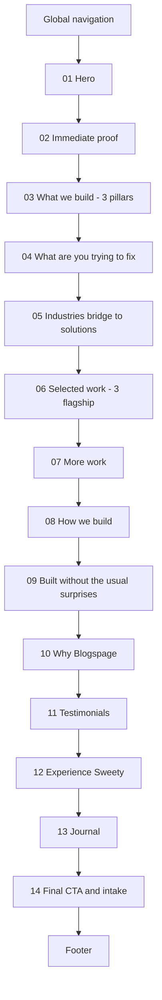

# Blogspage AI — Homepage Implementation Specification v1.0

> **Document type:** Implementation specification for a coding agent (Claude Sonnet / Roo Code).
> **Status:** Analysis and planning only. No source code was modified to produce this document.
> **Scope:** Homepage only (`/`).
> **Authoritative inputs:** `Homepage Conversion & Growth Blueprint v1.0.docx` (root) and [`plans/blogspage-architecture-report.md`](plans/blogspage-architecture-report.md).
> **Conflict rule applied:** where the blueprint and the repository disagree, verified repository architecture wins, the conflict is named explicitly, and shared infrastructure is preserved. No conflict is resolved silently.

## How to use this document

The executing agent should make **no strategic decisions**. Every section, every string of user-facing copy, every file path, and every acceptance test is specified below.

Three rules override everything else in this document:

1. **Never edit a file listed in §30 Protected Files.** If a task appears to require it, stop and report the blocker instead of proceeding.
2. **Never invent a client, testimonial, metric, award, business result, years of experience, or project outcome.** Where real data is required and the repository cannot supply it, the copy is marked `[OWNER INPUT REQUIRED]` and the component must be built so that it renders nothing at all when the data is absent.
3. **Preserve the four anchor IDs** `#contact`, `#process`, `#services`, `#models`. They are consumed by every `/solutions/*` route and by the global navbar. Renaming or dropping one breaks inbound links across the entire programmatic SEO surface.

---

# 1. Implementation Objective

Turn the homepage from a visually impressive brochure into a conversion-oriented product experience that makes a qualified visitor certain Blogspage is the right team to build their system, and then gives that visitor more than one way to start the conversation.

The change is in **clarity, evidence, relevance, trust and conversion** — not in adding decorative effects. The existing visual language (dark, technical, restrained glow, large type, spring-physics motion) is an asset and stays.

Four concrete outcomes define success:

1. **Repositioning.** The page reads as "Blogspage engineers the digital systems behind modern businesses," organised around three capability pillars — Digital Infrastructure, Operational Software, Intelligent Automation — instead of leading with an AI-marketing promise.
2. **Proof before persuasion.** Real, named, verifiable project work appears early and is presented as evidence, with claim classes (verified / descriptive / estimated) visibly honoured.
3. **A multi-path conversion system.** The AI chat stops being the single point of failure for lead capture. A visitor who distrusts chatbots, or who wants to reach a human, has a working alternative.
4. **Measurability.** Homepage CTA and conversion events are instrumented so that the next iteration is driven by data rather than intuition. Critically, "chat opened" and "lead captured" become distinguishable.

Non-goals for this sprint are enumerated in §31.

---

# 2. Current Homepage State

Verified against source, not carried forward on trust.

## 2.1 Route composition

`/` resolves through three files:

| Layer       | File                                                          | Rendering | Responsibility                                                                                                                         |
| ----------- | ------------------------------------------------------------- | --------- | -------------------------------------------------------------------------------------------------------------------------------------- |
| Root layout | [`src/app/layout.tsx`](src/app/layout.tsx:18)                 | server    | `<html lang="en-IN" class="dark">`, Geist fonts, `metadataBase`, **the homepage's own `<title>`/`<meta description>`**, `<Analytics/>` |
| Site shell  | [`src/app/(site)/layout.tsx`](<src/app/(site)/layout.tsx:16>) | server    | `SkipLink`, `JsonLd` with `organizationNode()`, `Preloader`, `Navbar`, `<main id="main">`, `Footer`, `ClientEnhancements`              |
| Page        | [`src/app/(site)/page.tsx`](<src/app/(site)/page.tsx:14>)     | server    | `JsonLd` with `webSiteNode()` + ten section components                                                                                 |

Current section order in [`page.tsx`](<src/app/(site)/page.tsx:18>):

```
Hero → ServicesBento → BentoGrid → ComparisonSection → DeliveryModels →
ProcessTimeline → FeaturedWork → LatestBlogs → CtaSection → ContactForm
```

## 2.2 Section inventory

| #   | Component           | File                                                                      | Server/Client                        | Owns anchor                   | Current CTA                   |
| --- | ------------------- | ------------------------------------------------------------------------- | ------------------------------------ | ----------------------------- | ----------------------------- |
| 01  | `Hero`              | [`hero.tsx`](src/components/home/hero.tsx:54)                             | **server** (+ client `hero-ambient`) | —                             | `#contact`, `#models`         |
| 02  | `ServicesBento`     | [`services-bento.tsx`](src/components/home/services-bento.tsx:1)          | client                               | `#services`                   | none                          |
| 03  | `BentoGrid`         | [`bento-grid.tsx`](src/components/home/bento-grid.tsx:1)                  | client                               | `#solutions`                  | 10 × `/solutions/<slug>`      |
| 04  | `ComparisonSection` | [`comparison-section.tsx`](src/components/home/comparison-section.tsx:45) | client                               | `#comparison`                 | none                          |
| 05  | `DeliveryModels`    | [`delivery-models.tsx`](src/components/home/delivery-models.tsx:40)       | **server**                           | `#models`                     | 2 × `#contact`                |
| 06  | `ProcessTimeline`   | [`process-timeline.tsx`](src/components/home/process-timeline.tsx:1)      | client                               | `#process`                    | none                          |
| 07  | `FeaturedWork`      | [`featured-work.tsx`](src/components/home/featured-work.tsx:1)            | client                               | `#work` (mobile variant only) | none                          |
| 08  | `LatestBlogs`       | [`latest-blogs.tsx`](src/components/home/latest-blogs.tsx:18)             | **server, async**                    | —                             | `/blogs`, 3 × `/blogs/<slug>` |
| 09  | `CtaSection`        | [`cta-section.tsx`](src/components/home/cta-section.tsx:146)              | client                               | —                             | `open-ai-chat` event          |
| 10  | `ContactForm`       | [`contact-form.tsx`](src/components/home/contact-form.tsx:66)             | client                               | `#contact`                    | `open-ai-chat` event          |

Seven of ten sections are client components. Framer Motion is imported by eight homepage-adjacent files. No `next/dynamic` code splitting exists for any homepage section.

## 2.3 Current copy that is being replaced

- H1: "We Build AI Systems That / Sell While You Sleep." ([`hero.tsx`](src/components/home/hero.tsx:7))
- Eyebrow: "AI automation & product engineering for category-defining founders"
- Trust strip label: "AI-native systems built on" over `["OpenAI","Vercel","Supabase","Next.js","Stripe"]` ([`hero-ambient.tsx`](src/components/home/hero-ambient.tsx:5)) — a **technology** credibility signal, not customer proof.
- `ServicesBento` four cards: Conversational AI Agents / Workflow Automation / Custom SaaS Development / Programmatic SEO Architectures. Informational only, **zero click targets**.
- `ComparisonSection`: "Typical Freelancer vs. Our Approach".
- `CtaSection`: "Ready to scale without the headcount?" + marquee + magnetic button.
- `ContactForm`: fake-terminal boot sequence, "Initialize System" button.

## 2.4 Current conversion funnel

Every homepage CTA converges on exactly two outcomes: an in-page scroll to `#contact`, or `window.dispatchEvent(new Event("open-ai-chat"))`.

Confirmed absent from the homepage: any native `<form>`, any email-only opt-in, any visible phone number, any WhatsApp link, any booking embed. `BookingCta` ([`booking-cta.tsx`](src/components/booking/booking-cta.tsx:1)) exists and is used on the dental and gym solution pages but is **never imported by any homepage section**. `submitLead` ([`src/app/actions/leads.ts`](src/app/actions/leads.ts:15)) is fully implemented and **never invoked by anything**.

The AI chat is therefore the sole lead-capture mechanism reachable from the homepage.

## 2.5 Current analytics

`@vercel/analytics`'s `<Analytics/>`, mounted once in the root layout. Pageviews only. Confirmed absent repo-wide: GA4, GTM, Clarity, `dataLayer`, any `track()` call, any custom event, any conversion pixel. The chat's own `leadCaptured` boolean drives a UI indicator and nothing else.

## 2.6 Verified defects the sprint must not inherit

**D-1 — Solution-page CTA links are malformed and almost certainly do not reach `#contact`.**

Every solution page links to the homepage using a string of this shape ([`solution-template.tsx`](src/components/solutions/solution-template.tsx:289), [`solution-hero.tsx`](src/components/solutions/solution-hero.tsx:52), [`gym-solution-landing.tsx`](src/components/solutions/gym-solution-landing.tsx:298), [`dental-solution-landing.tsx`](src/components/solutions/dental-solution-landing.tsx:228), [`dental-packages-landing.tsx`](src/components/solutions/dental-packages-landing.tsx:49)):

```
/#contact?niche=gym-fitness&city=hyderabad
```

Per the URL specification the fragment begins at `#` and runs to the end of the string. The fragment here is therefore the whole of `contact?niche=gym-fitness&city=hyderabad`, and `location.search` is **empty**. Two consequences follow:

1. `useSearchParams()` and `location.search` can never see `niche` or `city`. The architecture report's Tier-3 remediation item ("read the `?niche=`/`?city=` params in `ContactForm`") would not work as written — the values must be parsed out of `location.hash`.
2. No element on the homepage has `id="contact?niche=gym-fitness&city=hyderabad"`, so the fragment matches nothing and the browser has no anchor to scroll to.

Point 1 is a certainty from the URL spec. Point 2's practical effect — whether the browser lands the visitor at the top of the homepage instead of at the contact section — follows from the same reading but **must be confirmed by live QA** (§34, QA-14) rather than asserted. If confirmed, it means the highest-intent traffic on the site currently arrives at the wrong place.

Fixing the solution-page hrefs is **out of scope** for a homepage sprint (those files are solution-page components). This spec instead makes the homepage tolerant of the existing malformed links: TASK H13 parses the niche and city out of the hash. Repairing the hrefs themselves is logged in §31 as a follow-up.

**D-2 — Stale comment in [`hero.tsx`](src/components/home/hero.tsx:16).** The comment claims the `<h1>` "is at `opacity: 1` in the server-rendered HTML". [`globals.css`](src/app/globals.css:181) sets `.hero-word { opacity: 0 }` with `animation: ... both` and `animation-delay: calc(100ms + var(--word-index) * 80ms)`, so it is not. The text is in the DOM and fully crawlable, and the animation needs no JS, but the LCP claim is wrong. TASK H1 corrects the comment.

**D-3 — No `focus-visible` styling on any hand-rolled `<button>`.** Confirmed across the codebase. On the homepage this affects [`contact-form.tsx`](src/components/home/contact-form.tsx:164)'s "Initialize System" trigger and [`cta-section.tsx`](src/components/home/cta-section.tsx:117)'s `MagneticButton` — the page's two highest-intent controls. The `Button` primitive ([`ui/button.tsx`](src/components/ui/button.tsx:8)) already carries `focus-visible:ring-[3px] focus-visible:ring-ring/50`. TASK H16 fixes the homepage-local cases only.

**D-4 — Failing contrast on opacity modifiers.** `text-muted-foreground/50` and `text-white/30` composite to roughly 2.3:1 against `--background: #010102`, against a 4.5:1 AA floor. Homepage instances: [`contact-form.tsx`](src/components/home/contact-form.tsx:176) footnote and its `text-white/30` terminal strings, [`cta-section.tsx`](src/components/home/cta-section.tsx:187) footnote. TASK H16 fixes the homepage-local cases only. The navbar and chat-widget instances are global and stay out of scope.

**D-5 — No reduced-motion guard on Framer Motion sections.** `.hero-word`, `Preloader`, and `SmoothScroll` all check `prefers-reduced-motion`. The `whileInView` stagger reveals in `ServicesBento`, `BentoGrid`, `ComparisonSection`, `ProcessTimeline`, `CtaSection`, `ContactForm`, and `FeaturedWork` (mobile) do not. Framer Motion does not honour the media query unless a project wires `useReducedMotion()`, and no file does. TASK H16 addresses this for homepage sections.

---

# 3. Target Homepage State

A visitor lands, and in sequence:

| Window  | Stage        | Delivered by                                                                         |
| ------- | ------------ | ------------------------------------------------------------------------------------ |
| 0–5s    | ATTENTION    | Hero: dark canvas, kinetic H1, restrained ambient motion                             |
| 5–15s   | CLARITY      | Hero H1 + supporting line + capability line: "Websites · Software · AI · Automation" |
| 15–20s  | CURIOSITY    | Proof strip: real sectors and real project names, immediately below the fold line    |
| 20–40s  | RELEVANCE    | What We Build (three pillars) → What Are You Trying to Fix? (self-identification)    |
| 40–90s  | PROOF        | Selected Work (3 flagship builds) → More Work (supporting grid)                      |
| 90–150s | TRUST        | How We Build → Built Without the Usual Agency Surprises → Testimonials               |
| 150s+   | DESIRE       | Why Blogspage: Design + Engineering + AI, one team                                   |
| Final   | CONVERSATION | Final CTA with a primary path plus real alternatives                                 |

Structural differences from today:

- The AI-marketing headline is replaced by a systems-engineering position.
- Four non-clickable service cards become three capability pillars, each surfacing a real project.
- A new interactive problem-discovery section lets the visitor self-select, and routes each selection to a capability, a real project, and a contextual CTA.
- The portfolio stops being four visually equal cards and becomes three flagship stories plus a supporting grid.
- The comparison section stops attacking freelancers and starts articulating the Design + Engineering + AI advantage.
- The fake-terminal contact section becomes a real multi-path intake.
- Every meaningful CTA fires a named analytics event carrying attribution.

Unchanged by deliberate decision: the dark palette and glass/glow material system, the `.hero-word` CSS reveal, the server-rendered `<h1>`, idle-deferral of `ChatWidget`, the `NICHES`-driven internal-link bridge into `/solutions/*`, the `webSiteNode()` JSON-LD, all four anchor IDs, and homepage metadata (see CONFLICT-01).

---

# 4. Final Homepage Information Architecture

The blueprint's target IA is mapped onto components that already exist, so anchor contracts and shared data exports survive. **Anchor ownership is the binding constraint and is stated per row.**

| Order | Section                                                      | Component                                        | File                                                                      | Anchor          | Server/Client |
| ----- | ------------------------------------------------------------ | ------------------------------------------------ | ------------------------------------------------------------------------- | --------------- | ------------- |
| 01    | Hero                                                         | `Hero`                                           | [`hero.tsx`](src/components/home/hero.tsx:54)                             | —               | server        |
| 02    | Immediate Proof                                              | `HeroProofStrip` (renamed from `HeroTrustStrip`) | [`hero-ambient.tsx`](src/components/home/hero-ambient.tsx:53)             | —               | client        |
| 03    | What We Build (3 pillars)                                    | `ServicesBento`                                  | [`services-bento.tsx`](src/components/home/services-bento.tsx:1)          | **`#services`** | client        |
| 04    | What Are You Trying to Fix?                                  | `ProblemDiscovery` **(new)**                     | `src/components/home/problem-discovery.tsx`                               | `#problems`     | client        |
| 05    | Industries / Solutions bridge                                | `BentoGrid`                                      | [`bento-grid.tsx`](src/components/home/bento-grid.tsx:1)                  | `#solutions`    | client        |
| 06    | Selected Work (3 flagship)                                   | `FeaturedWork`                                   | [`featured-work.tsx`](src/components/home/featured-work.tsx:1)            | **`#work`**     | client        |
| 07    | More Work (supporting)                                       | `SupportingWork` **(new)**                       | `src/components/home/supporting-work.tsx`                                 | —               | server        |
| 08    | How We Build                                                 | `ProcessTimeline`                                | [`process-timeline.tsx`](src/components/home/process-timeline.tsx:1)      | **`#process`**  | client        |
| 09    | Built Without the Usual Agency Surprises + engagement models | `DeliveryModels`                                 | [`delivery-models.tsx`](src/components/home/delivery-models.tsx:40)       | **`#models`**   | server        |
| 10    | Why Blogspage (Design + Engineering + AI)                    | `ComparisonSection`                              | [`comparison-section.tsx`](src/components/home/comparison-section.tsx:45) | `#comparison`   | client        |
| 11    | Testimonials                                                 | `Testimonials` **(new, data-gated)**             | `src/components/home/testimonials.tsx`                                    | —               | server        |
| 12    | Experience Sweety                                            | `CtaSection`                                     | [`cta-section.tsx`](src/components/home/cta-section.tsx:146)              | `#sweety`       | client        |
| 13    | Journal                                                      | `LatestBlogs`                                    | [`latest-blogs.tsx`](src/components/home/latest-blogs.tsx:18)             | —               | server, async |
| 14    | Final CTA / Project Intake                                   | `ContactForm`                                    | [`contact-form.tsx`](src/components/home/contact-form.tsx:66)             | **`#contact`**  | client        |



## 4.1 Anchor contract — non-negotiable

| Anchor      | Must remain on                    | Inbound references that break if renamed                                                                                                                                    |
| ----------- | --------------------------------- | --------------------------------------------------------------------------------------------------------------------------------------------------------------------------- |
| `#contact`  | `ContactForm` section element     | Hero primary CTA, `DeliveryModels` × 2, `SolutionTemplate`, `SolutionHero`, `GymSolutionLanding`, `DentalSolutionLanding`, `DentalPackagesLanding`, `HotelHyderabadLanding` |
| `#process`  | `ProcessTimeline` section element | Navbar "Process", `SolutionTemplate` "See our process", `GymSolutionLanding` "See our process", Footer "Company" column                                                     |
| `#services` | `ServicesBento` section element   | Navbar "Services"                                                                                                                                                           |
| `#models`   | `DeliveryModels` section element  | Blueprint §23 mandates preservation                                                                                                                                         |

`#models` deserves a note. Today its only inbound link is the hero's "See what we automate". The new hero secondary CTA points at `#work` instead, which leaves `#models` with no inbound homepage link — but the blueprint explicitly requires the anchor be preserved, and an external or bookmarked link cannot be ruled out from source alone. Resolution: `DeliveryModels` is **kept, repurposed** as the section 09 risk-reduction surface and retains `id="models"`. This satisfies both constraints and preserves the `DELIVERY_MODELS` export that `/about` imports.

## 4.2 Sections removed from the page

None. Every existing section is either retained, repositioned, or repurposed. `BusinessOutcomes` ([`business-outcomes.tsx`](src/components/home/business-outcomes.tsx:30)) remains unimported dead code and is **not** introduced (see §28).

---

# 5. Global UX Principles

Binding on every task in this document.

1. **Comprehension never depends on interaction.** Every interactive section states its value in static text before any click, hover, or scroll. If JavaScript never runs, the page still explains what Blogspage does and offers a working link to contact.
2. **Comprehension never depends on animation.** Motion may reveal, emphasise, or reward. It may not be the only carrier of meaning, and it may not delay the moment a visitor can read the page.
3. **No critical CTA is hidden behind an interaction.** Primary CTAs are visible at rest.
4. **Claims carry their class.** Verified facts read as facts. Descriptive statements describe. Estimated figures render the literal word "estimated" in the same visible block as the number, exactly as [`featured-work-data.ts`](src/lib/featured-work-data.ts:21) already enforces via `ProjectMetric.basis`.
5. **Match the visitor's readiness.** An early-stage visitor gets a low-commitment path. A high-intent visitor gets a fast path. Nobody is forced into an AI chat, a long form, or a sales call.
6. **Mobile is a first-class layout,** not a collapsed desktop.
7. **Reuse before creation.** Prefer `Button`, `Card`, and the existing motion primitives (`SPRING = { type: "spring", stiffness: 100, damping: 20, mass: 1 }`) over new abstractions. Three new components are authorised in §27; no others.
8. **Read shared data, never rewrite it.** `NICHES`, `DELIVERY_MODELS`, and `projects` may be imported and rendered. Their shapes may only change as narrowly as §26 permits.
9. **Server by default.** A section becomes a client component only when it needs a hook. Two of the three new components are server components for this reason.
10. **Authentic register.** Banned from all copy: cutting-edge, revolutionary, next-generation, seamless, game-changing, unparalleled, transform. Prefer a concrete noun over an adjective.

---

# 6. Hero Implementation Specification

### TASK ID

H1

### TITLE

Reposition the hero to the digital-systems proposition

### OBJECTIVE

Replace the AI-marketing headline with the approved systems-engineering position, restate the CTA hierarchy so the primary action leads to the multi-path intake rather than straight into the chat, and keep the `<h1>` server-rendered and crawlable.

### FILES TO MODIFY

- `src/components/home/hero.tsx`

### FILES NOT TO MODIFY

- `src/app/layout.tsx` (holds the homepage `<title>`/`<meta description>`; see CONFLICT-01 — a metadata change is a separate, explicitly approved task)
- `src/app/globals.css` (the `.hero-word` keyframe and its reduced-motion guard are correct as written)
- `src/lib/seo.ts`, `src/lib/keyword-map.ts`, `src/lib/site.ts`
- `public/hero-visual.png` (already trimmed to 769×558 by `scripts/trim-hero-visual.mjs`)

### CURRENT BEHAVIOUR

`HEADLINE_LINES = ["We Build AI Systems That", "Sell While You Sleep."]` renders through `KineticHeadline`, one `<span class="hero-word">` per word with an incrementing `--word-index`. Eyebrow pill reads "AI automation & product engineering for category-defining founders". Body paragraph is a single 60-word sentence. Primary CTA "Deploy your AI system" → `#contact`; secondary "See what we automate" → `#models`. A stale comment at line 16 claims the `<h1>` renders at `opacity: 1`.

### DESIRED BEHAVIOUR

Same structure, same `KineticHeadline` mechanism, same server component, new copy and new CTA targets. Add a static capability line beneath the body copy. Correct the stale comment. Primary CTA points at `#contact` (the intake), secondary at `#work` (the proof).

The headline is 8 words, so the last word's reveal begins at `100ms + 7 × 80ms = 660ms` and completes at `1260ms`. To avoid pushing LCP further out than today's 7-word headline, **reduce the per-word stagger step for the hero only** by setting an inline `--word-step: 60ms` on the `<h1>` and having `globals.css` read `var(--word-step, 80ms)`. That is a one-line CSS change plus one inline style; it is the only `globals.css` edit authorised anywhere in this spec, and it is additive and backwards-compatible.

### EXACT COPY

Eyebrow pill:

```
Hyderabad-based digital systems and product engineering
```

H1 (`HEADLINE_LINES`):

```
Line 1: We Engineer the Digital Systems
Line 2: Behind Your Business.
```

Body:

```
Websites, web apps, SaaS and AI-powered automation built around how your
business actually works — not another disconnected collection of tools.
```

Capability line (static text, below body, above CTAs):

```
Websites · Software · AI · Automation
```

Primary CTA label:

```
Tell Us What You're Building
```

Secondary CTA label:

```
See Our Work
```

### INTERACTION

Both CTAs are `<Link>` elements wrapped by the `Button` primitive with `asChild`, exactly as today — real crawlable anchors, not JS handlers. Primary → `href="#contact"`. Secondary → `href="#work"`. Each fires its analytics event on click (§19). No hover state is required for comprehension.

### ANIMATION

Keep the CSS `.hero-word` reveal. Keep `HeroGradients`' breathing blobs. Do not introduce Framer Motion into `hero.tsx` itself — it must stay a server component. Reduce the stagger step to 60ms as described above.

### RESPONSIVE BEHAVIOUR

- H1: `text-5xl` base → `sm:text-7xl` → `lg:text-[7.5rem]`, unchanged.
- Reduce vertical padding on mobile from `pb-32 pt-32` to `pb-20 pt-28` so the fold reaches the proof strip sooner. Desktop `lg:pb-48 lg:pt-44` unchanged.
- Capability line: `text-xs` mobile, `text-sm` from `sm:`. It wraps to two lines on the narrowest phones; that is acceptable.
- CTAs stack full-width (`w-full sm:w-auto`) on mobile so both are comfortable tap targets.
- The decorative `/hero-visual.png` stays `hidden lg:block`.

### ACCESSIBILITY

- Exactly one `<h1>` on the page, and it stays here.
- The hero visual keeps `alt=""` inside its `aria-hidden` wrapper.
- The capability line is real text, not an image, and is not `aria-hidden`.
- Both CTAs inherit `Button`'s `focus-visible` ring.
- Eyebrow text must clear AA: use `text-muted-foreground` (6.4:1), never an opacity modifier.

### SEO

- `<h1>` stays in the server-rendered HTML and non-empty.
- Do not touch homepage metadata in this task. The rendered `<title>` remains `Blogspage: ai automation agency & SaaS studio`.
- The H1 no longer contains the phrase "ai automation agency". This is intentional and safe: [`seo.ts`](src/lib/seo.ts:358)'s keyword check compares the **title** against the phrase, never the H1. Verified by reading `reportBounds`.

### ANALYTICS

- Primary CTA → `hero_cta_click`, `{ cta_location: "hero", cta_label: "tell-us-what-youre-building", destination: "#contact" }`
- Secondary CTA → `work_cta_click`, `{ cta_location: "hero", cta_label: "see-our-work", destination: "#work" }`

Both require the wrapper from TASK H14. Because `hero.tsx` is a server component, the click handlers must live in a small client wrapper — reuse the existing pattern: put the instrumented CTA pair in `hero-ambient.tsx` (already `"use client"`) as an exported `HeroCtas` component, and compose it into the server tree. Do not add `"use client"` to `hero.tsx`.

### DEPENDENCIES

TASK H14 (analytics wrapper) must land first, or the CTA handlers must be added in a follow-up pass within the same task sequence.

### ACCEPTANCE CRITERIA

1. `curl` of the built page contains the literal string `We Engineer the Digital Systems` inside the `<h1>`.
2. `hero.tsx` contains no `"use client"` directive.
3. Exactly one `<h1>` element exists in the rendered homepage HTML.
4. Primary CTA is an `<a href="#contact">`; secondary is an `<a href="#work">`.
5. The capability line `Websites · Software · AI · Automation` is present as text.
6. The comment at former line 16 no longer claims `opacity: 1`.
7. With `prefers-reduced-motion: reduce`, all headline words are at full opacity on first paint.
8. At 375px width, the hero occupies less vertical space than before the change, and both CTAs are visible without horizontal scroll.

### VALIDATION

```
npm run build
npm run test
```

Then load `/`, confirm items 1–8 by inspection, toggle reduced motion in DevTools rendering panel, and confirm no new console errors (a `[seo]` dev warning would indicate a metadata regression and must be absent).

---

# 7. Proof / Trust Strip Specification

### TASK ID

H2

### TITLE

Convert the technology logo strip into customer and sector proof

### OBJECTIVE

Close the gap between technology credibility and business credibility. The strip currently proves Blogspage uses good tools; it must also prove Blogspage has shipped real systems for real categories.

### FILES TO MODIFY

- `src/components/home/hero-ambient.tsx`

### FILES NOT TO MODIFY

- `src/lib/featured-work-data.ts` (read-only in this task; TASK H6 owns its edits)
- `src/lib/site.ts`

### CURRENT BEHAVIOUR

`HeroTrustStrip` renders the label "AI-native systems built on" above five text tiles: OpenAI, Vercel, Supabase, Next.js, Stripe. It is a Framer Motion `whileInView` stagger with no reduced-motion guard, and each tile uses `text-white/45` (below AA).

### DESIRED BEHAVIOUR

Rename the export to `HeroProofStrip` (update the import in `hero.tsx`) and split it into two rows:

- **Row 1 — sectors shipped.** Text tiles naming the categories the four repository-verified projects actually serve.
- **Row 2 — built with.** The existing technology tiles, relabelled honestly.

An optional third line carries a verified count. It must be data-derived, never hardcoded: compute it as `projects.length` from `featured-work-data.ts` so the number can never drift from the portfolio.

### EXACT COPY

Row 1 label:

```
Systems shipped across
```

Row 1 tiles — these four are substantiated by [`featured-work-data.ts`](src/lib/featured-work-data.ts:39) descriptions:

```
AI SaaS
Subscription delivery
Hospitality
Content & SEO platforms
```

Row 2 label:

```
Built with
```

Row 2 tiles (unchanged, verified against `tech` arrays in the portfolio data):

```
Next.js
Supabase
Stripe
TypeScript
Vercel
```

Optional count line, rendered only when `projects.length > 0`:

```
{projects.length} shipped projects · Hyderabad, India
```

**Not permitted in this section:**

- The blueprint's suggested "8 portfolio projects" — the repository contains four. `[OWNER INPUT REQUIRED]`: if four more projects are real, they must be added to `featured-work-data.ts` with assets before any count above four is rendered.
- "3-day NeoDent delivery" — NeoDent does not exist anywhere in the repository. `[OWNER INPUT REQUIRED]`.
- "Lighthouse 100" for Phixl or any page — no measurement exists in the repository. `[OWNER INPUT REQUIRED]`, and per §23 it may only be published after re-verification against the exact page and version being cited.
- Healthcare and Fitness as sector tiles — no dental or gym client work exists in `featured-work-data.ts`. `[OWNER INPUT REQUIRED]`. If NeoDent and the gym builds are confirmed, add "Healthcare" and "Fitness" tiles at that point, not now.
- Any client logo. None exist in `public/`.

### INTERACTION

Static. No hover requirement. Tiles are not links.

### ANIMATION

Keep the `whileInView` stagger but gate it: call `useReducedMotion()` from `framer-motion` and, when it returns true, render with `initial="show"` so no transform or fade runs. Set `viewport={{ once: true, margin: "-100px" }}` as today.

### RESPONSIVE BEHAVIOUR

- Row 1: `grid-cols-2` mobile → `sm:grid-cols-4`.
- Row 2: `grid-cols-2` mobile → `sm:grid-cols-5` (matching today).
- Strip container: reduce `mt-28` to `mt-16` on mobile (`mt-16 lg:mt-28`) so proof enters the viewport sooner.
- Tile height `h-12` and `text-sm` unchanged.

### ACCESSIBILITY

- Both labels are real `<p>` elements, not `aria-hidden`.
- Raise tile text from `text-white/45` to `text-muted-foreground` (6.4:1 verified) and the hover state to `hover:text-foreground`.
- The strip is a list of facts, so mark each row up as a `<ul>` with `<li>` tiles rather than bare `<div>`s.

### SEO

Real text, crawlable. Sector names contribute genuine topical signal. No structured data is added here — sector tiles are not an `Organization` property and must not be smuggled into JSON-LD.

### ANALYTICS

None. Non-interactive.

### DEPENDENCIES

None. Can ship before or after TASK H1, though shipping together keeps the hero coherent.

### ACCEPTANCE CRITERIA

1. `HeroProofStrip` is exported and imported by `hero.tsx`; no reference to `HeroTrustStrip` remains.
2. Both labels and all nine tiles render as text in the server HTML.
3. The count line renders `4 shipped projects · Hyderabad, India` given the current four-entry `projects` array, and the number is not a literal in the JSX.
4. No tile text uses an opacity modifier below `/70`.
5. With reduced motion enabled, the strip is fully visible with no entrance animation.
6. The strings "Lighthouse", "NeoDent", "Healthcare", and "Fitness" appear nowhere in the file.

### VALIDATION

```
npm run build
```

Inspect the rendered strip at 375px and 1440px. Run an automated contrast check on the tile text against `#010102` and confirm ≥ 4.5:1. Temporarily add a fifth entry to `projects` locally to confirm the count line follows the data, then revert.

---

# 8. What We Build Specification

### TASK ID

H3

### TITLE

Replace four service cards with three capability pillars, each anchored to real work

### OBJECTIVE

Answer "can they build what I need?" within one screen, using the approved three-pillar capability model, and give the section the click targets it currently lacks.

### FILES TO MODIFY

- `src/components/home/services-bento.tsx`

### FILES NOT TO MODIFY

- `src/lib/niches.ts`, `src/lib/services-catalog.ts`, `src/lib/service-routes.ts` — the pillar model is a **presentation layer** over capabilities. It must not be pushed into the shared catalogs, which drive `/solutions`, `services.json`, `llms.txt`, and the chat's knowledge base.
- `src/components/home/bento-grid.tsx` (TASK H5 territory; the ten-niche bridge stays intact)

### CURRENT BEHAVIOUR

Four cards — Conversational AI Agents, Workflow Automation, Custom SaaS Development, Programmatic SEO Architectures — in a `md:col-span` bento with a mouse-tracked spotlight per card and a `whileInView` stagger. `id="services"`. No links anywhere in the section.

### DESIRED BEHAVIOUR

Three pillar cards in a `lg:grid-cols-3` layout. Each card carries a number, a title, a capability list, a one-sentence explanation of what layer of the business it addresses, and a "proof line" naming a real project. Each card's proof line is a link to the corresponding project on the homepage (`#work` for flagship projects, `#more-work` for supporting ones) — in-page, so no new route is required and no `/solutions` link semantics are disturbed.

Keep `id="services"`. Keep the spotlight hover and the stagger. Keep the section a client component.

### EXACT COPY

Eyebrow:

```
What we build
```

H2:

```
One connected system, not four disconnected vendors.
```

Sub-line:

```
Your website, your internal software and your automation layer are the same
system seen from three angles. We build all three.
```

**Pillar 01**

```
Number:  01
Title:   Digital Infrastructure
List:    Websites · Web apps · Headless CMS · SEO architecture
Body:    The digital layer your customers see, search and interact with.
Proof:   Built with this: Best100Movies — a Sanity-backed content platform with programmatic routes.
```

**Pillar 02**

```
Number:  02
Title:   Operational Software
List:    SaaS · Dashboards · Portals · Business workflows
Body:    The systems your team uses to run the business.
Proof:   Built with this: ArogyaDiet — customer, rider, franchise and master-admin portals on shared data.
```

**Pillar 03**

```
Number:  03
Title:   Intelligent Automation
List:    AI agents · Workflow automation · Lead capture · Customer follow-up
Body:    The intelligence layer that removes repetitive work and keeps opportunities moving.
Proof:   Built with this: Phixl AI — AI image restoration with credits, checkout and processing pipeline.
```

Notes on the copy, so the executing agent does not "improve" it into a false claim:

- Every proof line is a **descriptive** (Class B) statement drawn verbatim in substance from [`featured-work-data.ts`](src/lib/featured-work-data.ts:39). No outcome, uplift, or figure is asserted.
- The blueprint's pillar-03 list includes "n8n" and "WhatsApp". Neither appears anywhere in the repository, and §13 of the blueprint permits listing only tools genuinely used in client delivery. They are therefore **omitted**. `[OWNER INPUT REQUIRED]`: confirm n8n and WhatsApp are in real client delivery before adding them.
- The blueprint's pillar-01 proof example is "NeoDent / Headless CMS". NeoDent is absent from the repository, so Best100Movies — which is present, and is genuinely a headless-CMS build — carries the pillar instead. `[OWNER INPUT REQUIRED]` to substitute NeoDent once its data and asset exist.

### INTERACTION

- Cards keep the mouse-tracked spotlight (`--x`/`--y` CSS custom properties written on `onMouseMove`). This sets CSS variables only and triggers no React re-render; it is cheap and stays.
- The proof line inside each card is a real `<Link>` to the in-page target. The card body itself is **not** a link — nesting the whole card in an anchor would make the spotlight `div` an interactive region and hurt keyboard semantics.
- Nothing about the pillar is hidden behind hover or click. Expanding-card behaviour from the blueprint is explicitly declined: it would put comprehension behind interaction, violating §5.

### ANIMATION

`whileInView` stagger with `staggerChildren: 0.1`, `SPRING`, `viewport={{ once: true, margin: "-100px" }}` — as today. Add the `useReducedMotion()` gate.

### RESPONSIVE BEHAVIOUR

- `grid-cols-1` mobile → `md:grid-cols-3`. Drop the current asymmetric `col-span`/`row-span` map; three equal pillars are the point.
- Cards stack in numeric order on mobile. No horizontal scroll, no swipe carousel — three cards is short enough to scroll vertically.
- Pillar body text `text-sm` mobile, `text-base` from `lg:`.
- Minimum tap target for the proof link: 44×44 CSS px, achieved with `py-2 -my-2` padding on the link.

### ACCESSIBILITY

- Section keeps `id="services"` on the `<section>` element.
- One `<h2>` for the section, `<h3>` per pillar. No level is skipped.
- The pillar number is decorative relative to the heading, so render it inside the `<h3>` as a `<span aria-hidden>` prefix rather than as separate text a screen reader announces out of context.
- Capability lists are `<ul>`/`<li>`, not `·`-joined strings, with the visual separator supplied by CSS.
- The spotlight span keeps `aria-hidden`.

### SEO

- `<h2>` carries the positioning phrase. Real project names are indexable text.
- The section adds three in-page links only. It creates no external or internal route links, so the site's link graph is unchanged and no `Service` JSON-LD is emitted here (that node belongs to `/solutions` routes and must not be duplicated on the homepage).

### ANALYTICS

Each proof link → `solution_cta_click` with `{ cta_location: "what-we-build", pillar: "digital-infrastructure" | "operational-software" | "intelligent-automation", destination: "#work" | "#more-work" }`.

### DEPENDENCIES

TASK H14 for the event wrapper. TASK H6 and H7 must land for the `#work` and `#more-work` targets to exist; until then the links resolve to the page top, which is acceptable mid-sprint but must be fixed before QA sign-off.

### ACCEPTANCE CRITERIA

1. `id="services"` is present on the section element.
2. Exactly three pillar cards render, numbered 01–03, with the exact titles above.
3. Each card contains one `<Link>` whose text begins `Built with this:`.
4. The strings "n8n", "WhatsApp", and "NeoDent" appear nowhere in the file.
5. Heading order in the section is `h2` then three `h3`s.
6. With reduced motion, all three cards are visible at full opacity with no transform.
7. Navigating to `/#services` from another route scrolls to this section.

### VALIDATION

```
npm run build
npm run test
```

Load `/solutions` and click the navbar "Services" link; confirm it lands on this section. Keyboard-tab through the section and confirm three focus stops with a visible ring. Check heading order with an accessibility inspector.

---

# 9. Problem Discovery Interaction Specification

### TASK ID

H4

### TITLE

Add the "What are you trying to fix?" self-identification section

### OBJECTIVE

Move the visitor from passive scrolling to active self-identification, then route each self-selection to a relevant capability, a real project, and a contextual CTA. This is the single highest-leverage new surface on the page, because it is the only place the visitor tells us something about themselves before the conversion step.

### FILES TO MODIFY

- **Create** `src/components/home/problem-discovery.tsx`
- `src/app/(site)/page.tsx` (compose the section — covered formally by TASK H15)

### FILES NOT TO MODIFY

- `src/lib/niches.ts`, `src/lib/cities.ts`, `src/lib/routes.ts`, `src/lib/keyword-map.ts` — this interaction is **homepage-local** and must not become a route, a slug, or a catalog entry. Blueprint §9 states this explicitly and the architecture report's §29 boundary agrees.
- `src/components/chat-widget.tsx`, `src/app/api/chat/route.ts` — the section may dispatch the existing `open-ai-chat` event but must not change the chat's contract.

### CURRENT BEHAVIOUR

No such section exists.

### DESIRED BEHAVIOUR

A client component holding a hardcoded array of six options. All six option labels are visible at rest as a grid of selectable cards. Selecting one reveals a detail panel below the grid containing: an explanation, the matching capability pillar, one or two real project names, and a contextual CTA.

State model: `const [selected, setSelected] = useState<ProblemId | null>(null)`. On first render nothing is selected, and the detail panel shows a **static default** — not an empty box — so the section is meaningful with zero interaction and with JavaScript disabled the six labels still read as a statement of what Blogspage handles.

Selection is single-choice. Re-clicking the active card deselects it and returns the default panel.

### EXACT COPY

Eyebrow:

```
Start here
```

H2:

```
What are you trying to fix?
```

Sub-line:

```
Pick the closest one. We'll show you what we'd build and what we've already built.
```

Default panel (before any selection):

```
Most projects start as one of these six. Choose the closest and we'll show you
the system we'd put behind it.
```

**Option 1 — `better-website`**

```
Card label: I need a better website
Explanation: We design and engineer high-performance websites around your
             business goals — not a template with your logo dropped in.
Capability:  Digital Infrastructure
Projects:    Best100Movies · [OWNER INPUT REQUIRED — NeoDent, once its data and screenshot exist]
CTA:         Tell us about your website →
```

**Option 2 — `manual-work`**

```
Card label: My business relies on too much manual work
Explanation: We map the workflow first, then remove the repetitive steps with
             automation and connected systems instead of more spreadsheets.
Capability:  Intelligent Automation
Projects:    ArogyaDiet
CTA:         Tell us what's manual →
```

**Option 3 — `operations-software`**

```
Card label: I need software for my operations
Explanation: Role-based portals and dashboards on one shared data model, so
             your team stops reconciling four sources of truth.
Capability:  Operational Software
Projects:    ArogyaDiet · NextInn
CTA:         Tell us about your operations →
```

**Option 4 — `saas-product`**

```
Card label: I want to build a SaaS product
Explanation: Auth, payments, dashboards and the backend behind them —
             engineered so the MVP you validate is the product you can scale.
Capability:  Operational Software
Projects:    Phixl AI
CTA:         Tell us about your product →
```

**Option 5 — `add-ai`**

```
Card label: I want to add AI to my business
Explanation: We add AI where it removes friction — qualifying enquiries,
             processing work, answering customers — not as decoration.
Capability:  Intelligent Automation
Projects:    Phixl AI
CTA:         Tell us where AI would help →
```

**Option 6 — `not-sure`**

```
Card label: I'm not sure yet
Explanation: That's a normal starting point. Describe the business and the
             problem, and we'll tell you what we'd build and what we wouldn't.
Capability:  Design + Engineering + AI
Projects:    (none — this option shows no project)
CTA:         Talk it through with Sweety →
```

Project names must be rendered from a shared source, not retyped: import `projects` from [`src/lib/featured-work-data.ts`](src/lib/featured-work-data.ts:39) and reference entries by `id` (`best100movies`, `arogyadiet`, `nextinn`, `phixl-ai`), rendering `project.headline`. This guarantees the section cannot drift from the portfolio and cannot name a project that does not exist.

### INTERACTION

- Six cards, each a `<button type="button">` with `aria-pressed={selected === id}`.
- Detail panel is a single region below the grid, updated in place. It is **not** a modal, an accordion per card, or a tab strip that hides labels.
- Options 1–5 CTA → in-page `<Link href="#contact">` carrying the selection so the intake can pre-fill (see TASK H12/H13). Option 6 CTA → dispatches `open-ai-chat`, matching the existing global contract exactly: `window.dispatchEvent(new Event("open-ai-chat"))`.
- Selection is passed to the intake via a module-level custom event rather than a router navigation, so no query string, no re-render of the page, and no interaction with the SEO route layer: `window.dispatchEvent(new CustomEvent("homepage-problem-selected", { detail: { problem: id } }))`. TASK H12 listens for it.
- Keyboard: cards are buttons, so Enter and Space activate natively. Arrow-key navigation is **not** required — this is a set of independent toggles, not a radio group or a listbox, and `aria-pressed` describes it correctly.

### ANIMATION

- Card selection: border and background transition via CSS only, 200ms, no layout shift.
- Detail panel swap: a single `AnimatePresence` fade plus 8px rise, 200ms, keyed on the selected id. Nothing longer — this animation sits directly in the interaction path and must feel instant.
- Gate both behind `useReducedMotion()`; when reduced, swap content with no transition.
- Do not animate the six card labels on scroll-in with a long stagger; a 0.04s stagger at most, or none.

### RESPONSIVE BEHAVIOUR

- Grid: `grid-cols-1` at base, `sm:grid-cols-2`, `lg:grid-cols-3`.
- Cards are touch-friendly: minimum height 64px, full-width tap area, `text-left`.
- On mobile the detail panel appears immediately below the grid. When a selection is made on mobile, do **not** auto-scroll the viewport — an unrequested scroll is disorienting. Instead ensure the panel is directly adjacent so a short manual scroll reveals it.
- The panel must not collapse to a horizontally scrolling row on any breakpoint.

### ACCESSIBILITY

- Section element carries `id="problems"`.
- One `<h2>`; each card label is a `<span>` inside its button, not a heading.
- `aria-pressed` on every card button reflects state.
- The detail panel is `aria-live="polite"` so a screen-reader user hears the new content after selection. Use `polite`, never `assertive`.
- Every card button carries an explicit `focus-visible:ring-2 focus-visible:ring-ring/50 focus-visible:ring-offset-2 focus-visible:ring-offset-background` treatment — the `Button` primitive is not used here because these are custom-layout cards, so the ring must be declared (see D-3).
- All text at AA: body copy `text-muted-foreground` or lighter, never `/50` modifiers.
- The panel's CTA is a real link (options 1–5) or a real button (option 6). Never a `div` with `onClick`.

### SEO

- All six labels and all six explanations render in the server HTML for the default state. Because the component is a client component, its initial render is still server-rendered by Next.js — confirm this by viewing source, since the crawlable text is the point.
- The section adds no route, no slug, and no `FAQPage` node. It is not FAQ content and must not be marked up as such.

### ANALYTICS

Every card selection → `problem_selector_click`:

```json
{
  "problem": "better-website | manual-work | operations-software | saas-product | add-ai | not-sure",
  "cta_location": "problem-discovery",
  "selection_index": 1
}
```

Panel CTA click → `solution_cta_click` with `{ cta_location: "problem-discovery-panel", problem: "<id>", destination: "#contact" | "chat" }`. Option 6's CTA additionally fires `chat_open` with `{ trigger: "problem-discovery" }`.

### DEPENDENCIES

TASK H14 (analytics). TASK H12 (intake listens for `homepage-problem-selected`). Ships after H3 so the pillar names it references are live.

### ACCEPTANCE CRITERIA

1. All six labels are present in `view-source` output with no selection made.
2. The default panel text renders when `selected === null`.
3. Selecting a card sets `aria-pressed="true"` on it and `"false"` on the other five.
4. Re-clicking the active card returns the default panel.
5. Every project name shown comes from `projects` in `featured-work-data.ts` — grep the file and confirm no project name is a bare string literal.
6. Option 6 dispatches `open-ai-chat` and the widget opens.
7. Options 1–5 dispatch `homepage-problem-selected` with the correct id (observable in the console during QA).
8. Keyboard-only: all six cards reachable, visible focus ring on each, Enter and Space both activate.
9. With reduced motion, panel content swaps with no animation.
10. No file in §30 is modified.

### VALIDATION

```
npm run build
npm run test
```

Manual: tab through all six cards; select each and confirm the panel content matches the copy above exactly; confirm the `aria-live` region announces in a screen reader; confirm the events fire with correct payloads in the Vercel Analytics debug view or a temporary console shim.

---

# 10. Industries Bridge Specification

### TASK ID

H5

### TITLE

Reframe the ten-niche grid as a bridge to the solution routes

### OBJECTIVE

Keep the single most valuable internal-linking surface on the site intact while changing what it claims. The grid must read as "here are the categories we have built systems for" rather than as ten equally-proven case studies.

### FILES TO MODIFY

- `src/components/home/bento-grid.tsx`

### FILES NOT TO MODIFY

- `src/lib/niches.ts` — `NICHES` drives `/solutions/*` route generation, `services.json`, `llms.txt`, the sitemap and the chat knowledge base. Presentation changes must not reach it.
- `src/lib/cities.ts`, `src/lib/routes.ts`, `src/lib/service-routes.ts`

### CURRENT BEHAVIOUR

Ten `MotionLink` cards built from `NICHES`, each linking to `niche.href()`. An `ACCENT_MAP` supplies a per-niche icon colour and a raw RGB triple for the radial glow; a `SPAN_MAP` supplies the asymmetric `md:col-span` rhythm; `FEATURED_IDS` marks six niches for a watermark and a taller card. Mouse position is written into `--x`/`--y` custom properties on `onMouseMove`. `whileHover={{ scale: 1.015 }}`, `staggerChildren: 0.08`, `SPRING`. Section carries `id="solutions"`.

### DESIRED BEHAVIOUR

Structurally unchanged. All ten cards stay, all ten links stay, `ACCENT_MAP`, `SPAN_MAP`, `FEATURED_IDS`, the glow and the stagger all stay. Three changes only:

1. New eyebrow, `<h2>` and sub-line, so the section is framed as a capability index rather than a portfolio.
2. Add a `useReducedMotion()` gate around the stagger and the hover scale.
3. Add the analytics event on card click.

The `FEATURED_IDS` set stays exactly as written. It is a **visual** rhythm device, and re-deriving it from real client work would shrink the grid to four cards and destroy the internal-link surface. Because the new heading no longer claims these are delivered projects, the watermark treatment is no longer a truth problem.

### EXACT COPY

Eyebrow:

```
Industries
```

H2:

```
Systems we have built for specific industries.
```

Sub-line:

```
Every industry runs on different constraints. These are the ones we have
built for, with the workflows and integrations each one actually needs.
```

**Not permitted in this section:** any per-niche client count, any "trusted by N businesses in <industry>", any star rating, any logo. None exist. `[OWNER INPUT REQUIRED]` before any such element is added.

Note for the executing agent: the sub-line says "built for", which is a Class B descriptive claim about capability and delivery experience. It does not assert a named client per niche, and must not be edited into one.

### INTERACTION

Unchanged. The whole card remains a link — correct here, because the card's entire purpose is navigation, unlike the pillar cards in §8.

### ANIMATION

Keep `gridVariants`/`cardVariants` and `SPRING`. Gate both with `useReducedMotion()`: when true, render `initial="show"` and drop `whileHover`.

### RESPONSIVE BEHAVIOUR

- `grid-cols-1` mobile → `md:grid-cols-3` with the existing span map, unchanged.
- The mouse-tracked glow is pointer-only and inert on touch. No change required.

### ACCESSIBILITY

- Section keeps `id="solutions"`.
- One `<h2>`; each card title is an `<h3>`.
- Card text currently relies on low-opacity white in places; raise any value below `/70` to `text-muted-foreground`.
- The glow span and the watermark keep `aria-hidden`.
- Each card is a single `<a>` with an accessible name that includes the niche name, so a link-list readout is meaningful.

### SEO

The ten internal links are the highest-value internal-linking block on the homepage and must all survive. No JSON-LD is added here — `Service` nodes belong to the `/solutions` routes.

### ANALYTICS

Each card click → `niche_card_click` with `{ cta_location: "industries", niche: "<niche.id>", destination: "<niche.href()>" }`.

### DEPENDENCIES

TASK H14 for the event wrapper.

### ACCEPTANCE CRITERIA

1. `id="solutions"` is still on the section element.
2. Exactly ten cards render, each an `<a>` whose `href` comes from `niche.href()`. No href is a string literal.
3. `src/lib/niches.ts` is byte-identical to its pre-task state.
4. The new H2 string renders in the server HTML.
5. With reduced motion, all ten cards are at full opacity with no transform and no hover scale.
6. No card text uses an opacity modifier below `/70`.
7. `npm run build` emits the same number of `/solutions/*` routes as before the change.

### VALIDATION

```
npm run build
npm run test
```

Compare the route manifest before and after to confirm item 7. Tab through the grid and confirm ten focus stops with a visible ring.

---


# 11. Selected Work Specification

### TASK ID

H6

### TITLE

Reduce the pinned showcase to three flagship projects and repair the `#work` anchor

### OBJECTIVE

Make the proof section carry a working anchor, cost less on desktop, and present three flagship builds as evidence with their claim classes intact.

### FILES TO MODIFY

- `src/components/home/featured-work.tsx`

### FILES NOT TO MODIFY

- `src/lib/featured-work-data.ts` — **read-only.** `/about` imports `projects` and slices it. Changing the array's order or length changes `/about` silently. Selection of flagships must happen in the component by `id`, never by reordering the source array.
- `public/phixlAI.jpg`, `public/NextInn.jpg`, `public/ArogyaDiet.jpg`, `public/movieDB.png`

### CURRENT BEHAVIOUR

`FeaturedWork` renders **both** variants unconditionally:

```tsx
<MobileVerticalStack />     // <section id="work" className="... py-16 md:hidden">
<DesktopHorizontalScroll /> // <section className="relative hidden h-[400vh] md:block">
```

Two verified facts follow, both load-bearing:

1. **D-6 — `#work` has no scroll target on desktop.** `id="work"` occurs exactly once in the entire repository, on the `md:hidden` mobile section ([`featured-work.tsx`](src/components/home/featured-work.tsx:228)). The desktop section carries no `id`. At `md` and above the mobile section is `display: none`, so `#work` resolves to a hidden element. The hero's new secondary CTA (§6) and the pillar proof links (§8) all point at `#work`, which means on desktop they have nothing to scroll to. This must be fixed here or those CTAs are dead on the majority of sessions.
2. **Performance.** `h-[400vh]` sticky container with four `next/image` renders and continuous `useTransform` recalculation while in view — the single largest client-side cost on the homepage, per the architecture report's §22 ranking.

Project description text uses `text-white/50` (below AA).

### DESIRED BEHAVIOUR

Three changes. The pinned horizontal scroll is **optimised, not removed** — it is a genuine brand asset and the strongest visual moment on the page.

1. **Anchor fix.** Wrap both variants in a single element that owns the anchor:

```tsx
export function FeaturedWork() {
  return (
    <div id="work" className="scroll-mt-24">
      <MobileVerticalStack />
      <DesktopHorizontalScroll />
    </div>
  );
}
```

   and **remove** `id="work"` from `MobileVerticalStack`'s `<section>`. Exactly one element in the document may carry the id. `scroll-mt-24` keeps the heading clear of the fixed navbar.

2. **Three flagships.** Render only `arogyadiet`, `phixl-ai`, `nextinn`, selected by id:

```tsx
const FLAGSHIP_IDS = ["arogyadiet", "phixl-ai", "nextinn"] as const;
const flagships = FLAGSHIP_IDS
  .map((id) => projects.find((p) => p.id === id))
  .filter((p): p is FeaturedProject => Boolean(p));
```

   Deriving by id rather than by index means a future reorder of the source array cannot silently change what renders. `best100movies` moves to the supporting section in §12.

3. **Reduce the pin.** With three panels instead of four, shorten the container from `h-[400vh]` to `h-[300vh]` so scroll distance matches content. Add `will-change: transform` to the translated track only, and gate the pinned behaviour behind `useReducedMotion()` — when reduced motion is requested, render the desktop variant as a plain vertical grid with no sticky container and no scroll transform.

### EXACT COPY

Eyebrow (both variants):

```
Selected work
```

H2:

```
Three systems, built end to end.
```

Sub-line:

```
Each one is a full system rather than a single screen — the customer-facing
surface, the software the team runs on, and the automation between them.
```

Per-project copy comes **entirely** from `featured-work-data.ts`: `tag`, `headline`, `description`, `tech`, `metrics`. No project copy is written into the component.

`MetricLine` must keep rendering `basis` in the same visible block as the value, exactly as today. All four figures in the data are `"estimated"`, and the literal word must remain adjacent to the number. Do not shorten "estimated" to a symbol, a tooltip, or a colour.

**Not permitted:** any project not in `featured-work-data.ts`. Specifically **NeoDent, Headless CMS Website, Premium Gym Website and Custom Gym Software have no data and no image assets in this repository** and must not be rendered. `dental-solution-landing.tsx` and `gym-solution-landing.tsx` are programmatic-SEO vertical templates, not client case studies, and must never be cited as proof of delivered client work. `[OWNER INPUT REQUIRED]` for each, with a real screenshot in `public/`, before any of them appears.


### INTERACTION

Keep the hover "muted reveal" filter on screenshots. Add no click target to the cards — these are not case-study pages, and linking them to nothing, or to a `#` placeholder, would be worse than leaving them static. `[OWNER INPUT REQUIRED]`: if per-project case-study pages are wanted, that is a separate route-creating sprint, out of scope here.

### ANIMATION

Keep `useScroll` + `useTransform` driving `translateX` on desktop, over `h-[300vh]`. Keep the mobile stagger. Both gated by `useReducedMotion()`. Set `viewport={{ once: true }}` on the mobile stagger so it cannot re-run.

### RESPONSIVE BEHAVIOUR

- `MobileVerticalStack` stays `md:hidden`; `DesktopHorizontalScroll` stays `hidden md:block`. Only one is ever visible, and the shared wrapper owns the anchor for both.
- Three panels at `100vw` each on desktop; the transform range must be recalculated for three, not four. A hardcoded four-panel offset left behind would strand the last panel off-screen.
- Mobile cards stay full-width single column.

### ACCESSIBILITY

- Exactly one `id="work"` in the document, on the wrapper.
- Raise `text-white/50` on descriptions to `text-muted-foreground`.
- Both variants contain an `<h2>`, which is a duplicate-heading risk since both are in the DOM. Because only one is ever rendered visibly and the other is `display: none`, assistive technology ignores the hidden one — acceptable, and no change required. Do not "fix" this by adding `aria-hidden` to a visible section.
- Screenshot `alt` keeps `project.headline`.

### SEO

- All three project names, descriptions and tech stacks render as crawlable text in both variants.
- No `CreativeWork` or `Review` JSON-LD. There is no review data, and inventing rating markup would be a structured-data violation.

### ANALYTICS

None on the cards, since they are not interactive. If the desktop pin is later instrumented for scroll depth, that is a follow-up in §31.

### DEPENDENCIES

TASK H7 must land in the same sprint so `best100movies` is not dropped from the page entirely.

### ACCEPTANCE CRITERIA

1. `grep -c 'id="work"'` over `src/` returns exactly 1, and it is on the wrapper in `FeaturedWork`.
2. Navigating to `/#work` at a 1440px viewport scrolls to the work section. This is the direct regression test for D-6 and must be checked at desktop width, not only mobile.
3. Exactly three projects render in both variants: ArogyaDiet, Phixl AI, NextInn.
4. `src/lib/featured-work-data.ts` is byte-identical to its pre-task state.
5. `/about` renders the same projects it did before the change.
6. Every metric figure has the word `estimated` in the same visible block.
7. The desktop container is `h-[300vh]` and the last panel comes fully to rest on screen at the end of the pin.
8. With reduced motion, the desktop variant has no sticky container and all three projects are reachable by normal scrolling.
9. The strings `NeoDent`, `Premium Gym`, `Custom Gym` appear nowhere in the file.

### VALIDATION

```
npm run build
npm run test
```

Manual, at 1440px: click the hero's "See Our Work" and confirm it lands on this section. Scroll the full pin and confirm the third panel is not clipped. Load `/about` and diff the project list against a pre-change screenshot. Toggle reduced motion and confirm the pin is gone.

---


# 12. Supporting Work Specification

### TASK ID

H7

### TITLE

Add a lightweight supporting-work section for non-flagship projects

### OBJECTIVE

Keep `best100movies` on the page after §11 narrows the pinned showcase to three, and give the `#more-work` target referenced by the pillar cards in §8 a real element to resolve to.

### FILES TO MODIFY

- **Create** `src/components/home/supporting-work.tsx`
- `src/app/(site)/page.tsx` (composition — covered formally by TASK H15)

### FILES NOT TO MODIFY

- `src/lib/featured-work-data.ts` — read-only, same reasoning as §11.
- `src/components/home/featured-work.tsx` — H6 owns that file.

### CURRENT BEHAVIOUR

No such section exists. `best100movies` currently renders inside `FeaturedWork` as the fourth panel.

### DESIRED BEHAVIOUR

A **server component** — it needs no hooks, so it must not carry `"use client"`. It renders every project in `projects` that is not a flagship, derived rather than hardcoded:

```tsx
const FLAGSHIP_IDS = new Set(["arogyadiet", "phixl-ai", "nextinn"]);
const supporting = projects.filter((p) => !FLAGSHIP_IDS.has(p.id));
```

Presentation is deliberately quieter than §11: a compact row of cards with tag, headline, one-line description and tech pills. No pinned scroll, no large screenshot, no Framer Motion. This section exists to be complete and cheap, not to compete with the flagships.

The section element carries `id="more-work"` with `scroll-mt-24`.

**The whole section must render nothing when `supporting.length === 0`** — return `null`. Today it renders one card. If the flagship set ever expands to cover every project, the section disappears cleanly rather than leaving an empty heading behind.

### EXACT COPY

H2:

```
More systems we have shipped.
```

Sub-line:

```
Smaller builds and platform work from the same stack.
```

Per-project copy comes entirely from `featured-work-data.ts`. Metrics keep their `basis` word if metrics are rendered here; if space is tight, omit the metric line entirely rather than rendering a figure without its basis.

**Not permitted:** placeholder cards, "and many more", "N+ projects", or any count that exceeds `projects.length`.

### INTERACTION

Static. No links, no hover requirement.

### ANIMATION

None. This is a server component and must stay one. Do not add a reveal animation — it would force `"use client"` for no comprehension benefit.

### RESPONSIVE BEHAVIOUR

- `grid-cols-1` mobile → `sm:grid-cols-2` → `lg:grid-cols-3`. With a single supporting project today the card renders at one column width on desktop; constrain the grid with `max-w-md` when `supporting.length === 1` so a lone card does not stretch awkwardly across the full width.

### ACCESSIBILITY

- `id="more-work"` on the section element.
- One `<h2>`, `<h3>` per project card. No skipped levels relative to §11's `<h2>`.
- Tech pills are a `<ul>`/`<li>` list, not `·`-joined text.
- All text at AA; no opacity modifier below `/70`.

### SEO

Crawlable text, no new routes, no JSON-LD.

### ANALYTICS

None. Non-interactive.

### DEPENDENCIES

Ships with H6. The `#more-work` links in §8's pillar cards resolve only once this section exists.

### ACCEPTANCE CRITERIA

1. The file contains no `"use client"` directive.
2. `id="more-work"` is present exactly once in the document.
3. Exactly one card renders today, for Best100Movies, and it is derived by filtering rather than hardcoded.
4. Navigating to `/#more-work` scrolls to this section at both 375px and 1440px.
5. The component returns `null` when the filtered array is empty — verify by temporarily adding `best100movies` to `FLAGSHIP_IDS`, confirming the section vanishes with no empty heading, then reverting.
6. `src/lib/featured-work-data.ts` is unmodified.
7. No Framer Motion import appears in the file.

### VALIDATION

```
npm run build
npm run test
```

Confirm in the build output that this component is not marked as a client boundary. Check heading order across §11 and §12 with an accessibility inspector.

---


# 13. Process Timeline Specification

### TASK ID

H8

### TITLE

Reframe the process timeline around visitor risk rather than internal method

### OBJECTIVE

Answer "what will actually happen if I hire them, and when do I see something?" The section currently describes how Blogspage works internally. It must describe what the client receives at each stage.

### FILES TO MODIFY

- `src/components/home/process-timeline.tsx`

### FILES NOT TO MODIFY

- `src/lib/site.ts`
- `src/components/home/delivery-models.tsx` — H9 owns that file.

### CURRENT BEHAVIOUR

A four-phase timeline with a scroll-driven SVG line draw (`ScrollLine`, one `useScroll` target). Section carries `id="process"`, which the navbar, `SolutionTemplate`, `GymSolutionLanding` and the footer all link to.

### DESIRED BEHAVIOUR

Same four phases, same `ScrollLine`, same anchor. Each phase gains an explicit **deliverable** line naming what the client ends the phase holding. Add a `useReducedMotion()` gate so the line renders complete rather than drawing.

No phase may state a duration in days or weeks. `[OWNER INPUT REQUIRED]`: no delivery-time data exists in the repository, and the "Live in 14 days" copy on the dental landing page is vertical-template marketing copy, not a verified delivery record. Do not carry it onto the homepage.

### EXACT COPY

H2:

```
How the work actually runs.
```

Sub-line:

```
Four phases, each ending in something you can look at and respond to.
```

Per-phase deliverable lines, appended to the existing phase content:

```
Phase 1 — You end with: a written scope, a system diagram and a fixed price.
Phase 2 — You end with: clickable screens of the real interface, before code.
Phase 3 — You end with: a working system on a staging URL you can use.
Phase 4 — You end with: the live system, the accounts, and the handover docs.
```

The phase titles and body copy already in the file are retained unless they contain a banned word from §5 item 10, in which case replace the word only.

### INTERACTION

Static. The timeline is read, not operated.

### ANIMATION

Keep `ScrollLine`. Gate with `useReducedMotion()`: when true, render the path at full length with no scroll binding.

### RESPONSIVE BEHAVIOUR

- Timeline stays single-column on mobile with the line on the left.
- Deliverable line is `text-sm` and must not be truncated or hidden behind a "read more" at any width.

### ACCESSIBILITY

- Section keeps `id="process"`. This anchor has four external inbound references; renaming it is a §30 violation.
- One `<h2>`, `<h3>` per phase.
- The SVG line is decorative: `aria-hidden` with no accessible name.
- Deliverable lines are real text, never `::after` content.

### SEO

Crawlable text. No `HowTo` JSON-LD — Google deprecated `HowTo` rich results for most surfaces, and this is a service process rather than an instructional how-to. Do not add it.

### ANALYTICS

None. Non-interactive.

### DEPENDENCIES

None.

### ACCEPTANCE CRITERIA

1. `id="process"` is unchanged on the section element.
2. All four deliverable lines render as text, each beginning `You end with:`.
3. No duration, day count, or week count appears anywhere in the file.
4. With reduced motion, the SVG line is fully drawn on first paint.
5. Clicking "Process" in the navbar from `/solutions` lands on this section.

### VALIDATION

```
npm run build
npm run test
```

Confirm item 5 from a `/solutions/*` route, not just from `/`.

---


# 14. Risk Reduction and Engagement Models Specification

### TASK ID

H9

### TITLE

Reframe delivery models as risk reduction and preserve the `#models` anchor

### OBJECTIVE

Address the unspoken objection — "what if this goes the way my last agency project went?" — and keep the `#models` anchor and the `DELIVERY_MODELS` export intact.

### FILES TO MODIFY

- `src/components/home/delivery-models.tsx`

### FILES NOT TO MODIFY

- The `DELIVERY_MODELS` export's shape. `/about` imports it. Adding a field is permitted only if every consumer keeps working; changing or removing a field is not.

### CURRENT BEHAVIOUR

A server component rendering the `DELIVERY_MODELS` array with two `#contact` CTAs. Carries `id="models"`.

### DESIRED BEHAVIOUR

Keep the server component, the array, both CTAs and the anchor. Add a leading risk-reduction block of four commitments above the model cards.

Per §4.1, `#models` loses its only inbound homepage link when the hero's secondary CTA moves to `#work`. The anchor is still **preserved** — external and bookmarked links cannot be ruled out from source, and the blueprint mandates it. Do not delete it on the grounds that nothing links to it.

### EXACT COPY

H2:

```
Built without the usual agency surprises.
```

The four commitments — each must be a statement Blogspage can actually keep, since these are promises, not features:

```
Fixed scope, fixed price. The number in the proposal is the number you pay.
You own everything. Code, accounts, domains and data are yours from day one.
You see progress weekly. No month-long silences.
Direct access to the engineer. Not an account manager relaying messages.
```

**Not permitted:** any money-back guarantee, refund promise, SLA, uptime figure, or response-time guarantee. None are substantiated anywhere in the repository, and each is a contractual commitment. `[OWNER INPUT REQUIRED]` before any of them is added.

Note: "Direct access to the engineer" is consistent with a small team and is safe as written. If Blogspage is a solo operation it is verifiably true; if it grows, it remains a policy statement rather than a metric.

### INTERACTION

Both existing `#contact` CTAs are retained and instrumented.

### ANIMATION

None. This is a server component and must stay one. Do not add Framer Motion.

### RESPONSIVE BEHAVIOUR

- Commitments: `grid-cols-1` mobile → `sm:grid-cols-2`.
- Model cards keep their current layout.
- CTAs full-width on mobile.

### ACCESSIBILITY

- `id="models"` preserved.
- Commitments are a `<ul>`. The bolded lead of each item is a `<strong>` inside the `<li>`, not a separate heading.
- One `<h2>` for the section.

### SEO

Crawlable text. No `Offer` or `PriceSpecification` JSON-LD — no real prices exist, and marking up "fixed price" without a figure would be invalid.

### ANALYTICS

Both CTAs → `contact_cta_click` with `{ cta_location: "models", destination: "#contact" }`.

### DEPENDENCIES

TASK H14.

### ACCEPTANCE CRITERIA

1. `id="models"` is present on the section element.
2. The file contains no `"use client"` directive.
3. All four commitments render as text.
4. The strings `guarantee`, `refund`, `SLA`, `uptime` appear nowhere in the file.
5. `DELIVERY_MODELS` is imported and rendered, and `/about` still builds.
6. Navigating to `/#models` scrolls here.

### VALIDATION

```
npm run build
npm run test
```

Load `/about` and confirm the delivery models still render there unchanged.

---


# 15. Why Blogspage Specification

### TASK ID

H10

### TITLE

Rebuild the comparison section around three capabilities in one team

### OBJECTIVE

Replace an adversarial "us vs. freelancers" frame with a positive differentiation claim that is defensible from the repository: design, engineering and AI in one team rather than three vendors.

### FILES TO MODIFY

- `src/components/home/comparison-section.tsx`

### FILES NOT TO MODIFY

- `src/components/home/delivery-models.tsx`, `src/components/home/process-timeline.tsx`

### CURRENT BEHAVIOUR

A two-column "Typical Freelancer vs. Our Approach" comparison. Client component, `SPRING` motion, `id="comparison"`.

### DESIRED BEHAVIOUR

Keep the client component, the anchor and the two-column layout mechanism, but change what the columns compare. The left column becomes the **cost of splitting the work across vendors**; the right column becomes **what one team owning all three layers gives you**. No named competitor, and no "freelancer" as a slur — many visitors have hired freelancers successfully, and insulting that choice insults the visitor.

### EXACT COPY

H2:

```
Design, engineering and AI in one team.
```

Sub-line:

```
Most projects need all three. Splitting them across three vendors is where
the delays and the finger-pointing come from.
```

Left column heading:

```
Split across vendors
```

Left column items:

```
The designer hands over screens nobody has costed to build.
The developer builds what was drawn, not what the business needs.
The automation is bolted on afterwards, by someone else again.
Every handover is a place for the schedule to slip.
When something breaks, nobody owns it.
```

Right column heading:

```
One team, one system
```

Right column items:

```
The person designing it knows what it costs to build.
The interface and the data model are decided together.
Automation is designed into the system, not added to it.
No handovers, so no handover delays.
One team owns the outcome end to end.
```

**Not permitted:** any named competitor or agency, any percentage or multiplier of speed or cost saving, any "N× faster" claim. None are measured. `[OWNER INPUT REQUIRED]`.

### INTERACTION

Static comparison. No tabs, no toggle. Both columns are visible at rest per §5 item 1.

### ANIMATION

Keep the existing `SPRING` reveal with `viewport={{ once: true }}`. Add the `useReducedMotion()` gate.

### RESPONSIVE BEHAVIOUR

- Two columns side by side from `md:`; stacked on mobile with "Split across vendors" first so the visitor reads the problem before the resolution.
- Never a horizontally scrolling table.

### ACCESSIBILITY

- `id="comparison"` preserved.
- One `<h2>`, `<h3>` per column.
- Each column is a `<ul>`. Do not use a `<table>` — this is not tabular data with row relationships, and a table would announce misleading row pairings.
- Any check or cross icon is `aria-hidden`, with the meaning carried by the column heading and the text.

### SEO

Crawlable text. No `FAQPage` markup — this is not question-and-answer content.

### ANALYTICS

None. Non-interactive.

### DEPENDENCIES

None.

### ACCEPTANCE CRITERIA

1. `id="comparison"` is unchanged.
2. All ten items render as text in two `<ul>` elements.
3. The word `freelancer` appears nowhere in the file.
4. No numeric claim of speed, cost or quality appears anywhere in the file.
5. On mobile the "Split across vendors" column appears above "One team, one system".
6. With reduced motion, both columns are fully visible with no transform.
7. No `<table>` element is used.

### VALIDATION

```
npm run build
npm run test
```

Check the mobile stacking order at 375px directly.

---


# 16. Testimonials Specification

### TASK ID

H11

### TITLE

Add a data-gated testimonials section that renders nothing without real data

### OBJECTIVE

Create the surface that social proof will occupy, structured so it is impossible to ship with invented quotes and so it disappears entirely until real testimonials exist.

### FILES TO MODIFY

- **Create** `src/components/home/testimonials.tsx`
- **Create** `src/lib/testimonials-data.ts`
- `src/app/(site)/page.tsx` (composition — TASK H15)

### FILES NOT TO MODIFY

- `src/lib/featured-work-data.ts` — testimonials are a separate concern and must not be bolted onto project data.

### CURRENT BEHAVIOUR

No testimonials exist anywhere on the site. No quote, name, company, photo, or rating exists in the repository.

### DESIRED BEHAVIOUR

A **server component** reading a typed array that ships **empty**:

```ts
export type Testimonial = {
  quote: string;
  authorName: string;
  authorRole: string;
  company: string;
  projectId?: string;
};

/**
 * Intentionally empty. No testimonial may be added without written client
 * permission for attributed publication. An anonymous testimonial
 * ("a client in hospitality") is not publishable proof and must not be
 * added here as a placeholder.
 */
export const testimonials: Testimonial[] = [];
```

The component's first statement is the gate:

```tsx
if (testimonials.length === 0) return null;
```

This is the entire point of the task. The section is built now, correctly, so that adding real data later is a one-file change with no layout work and no temptation to fabricate.

### EXACT COPY

H2 (renders only when data exists):

```
What clients say about the work.
```

Every rendered card shows the quote, the author's name, their role, and their company. All four are required by the type — an unattributed quote cannot be represented, which is deliberate.

**Not permitted under any circumstance:** a placeholder quote, a lorem-ipsum quote, a paraphrased quote, an anonymous quote, a stock photo, a star rating, or a "trusted by" logo wall. `[OWNER INPUT REQUIRED]` with written permission per testimonial.

### INTERACTION

Static. No carousel — a carousel with one or two testimonials looks worse than a static pair, and hides content behind interaction per §5 item 1.

### ANIMATION

None. Server component.

### RESPONSIVE BEHAVIOUR

- `grid-cols-1` mobile → `md:grid-cols-2` when two or more testimonials exist. With exactly one, render a single centred card at `max-w-2xl`.

### ACCESSIBILITY

- Each quote is a `<blockquote>` with the attribution in a `<figcaption>` inside a `<figure>`. Do not put attribution inside the `<blockquote>`.
- One `<h2>`.
- No decorative quotation-mark glyph is announced; mark it `aria-hidden`.

### SEO

- No `Review` or `AggregateRating` JSON-LD in v1.0. Review markup on an organisation requires real, verifiable reviews, and self-serving review snippets are a documented structured-data violation. When real testimonials exist, adding markup is a separate decision, logged in §31.

### ANALYTICS

None.

### DEPENDENCIES

None. Ships as a no-op.

### ACCEPTANCE CRITERIA

1. `testimonials` is exported as an empty array.
2. The homepage renders no testimonials section, no heading, and no empty container today. Confirm by searching the rendered HTML for the H2 string and finding nothing.
3. The component returns `null` before any JSX when the array is empty.
4. Temporarily adding one fabricated entry locally renders one centred card correctly; the entry is then removed. This is a local scratch edit only and must not be committed.
5. No `Review` or `AggregateRating` JSON-LD is emitted on the homepage.
6. The file contains no `"use client"` directive.

### VALIDATION

```
npm run build
npm run test
```

Validate the rendered homepage in Google's Rich Results Test and confirm no review markup is detected.

---


# 17. Experience Sweety Specification

### TASK ID

H12

### TITLE

Reposition the AI chat section as an optional demo and remove the false capability claim

### OBJECTIVE

Keep the chat as a genuine differentiator while removing the copy that misrepresents what the system is, and stop the chat being framed as the only way to talk to Blogspage.

### FILES TO MODIFY

- `src/components/home/cta-section.tsx`

### FILES NOT TO MODIFY

- `src/components/chat-widget.tsx`, `src/app/api/chat/route.ts` — the section dispatches `open-ai-chat` and must not change the chat's contract or its model configuration.

### CURRENT BEHAVIOUR

"Ready to scale without the headcount?" with an infinite marquee, a magnetic button, and a `window.dispatchEvent(new Event("open-ai-chat"))` handler. The marquee runs continuously with no `whileInView` gate. Line 189 carries an unverifiable promise.

### DESIRED BEHAVIOUR

Reframe as an optional demo of a real capability: the chat is a working example of the automation Blogspage builds, and trying it is a low-commitment way to see the work. It is offered **alongside** the form in §18, never as a replacement.

Add `id="sweety"` to the section. Gate the marquee so it pauses when out of view and stops entirely under reduced motion.

### EXACT COPY

H2:

```
Talk to a system we built.
```

Body:

```
Sweety is an AI assistant running on this site. It answers questions about
what we build, how we work and what your project would involve. It is also a
working example of the automation layer we build for clients.
```

CTA label:

```
Try Sweety
```

Secondary line beneath the CTA:

```
Would rather talk to a person? Use the form below.
```

**Removed:** the unverifiable promise at [`cta-section.tsx`](src/components/home/cta-section.tsx:189). `[OWNER INPUT REQUIRED]` if any response-time or availability claim is to be made about the chat.

**Not permitted:** "proprietary LLM", "our own model", "trained on your business", or any claim of a bespoke model. The chat runs OpenAI `gpt-4o-mini` through the Vercel AI SDK. Describing that as proprietary is false. Describe it as "an AI assistant we built on this site", which is true — the integration, prompt design and knowledge base are genuinely Blogspage's work.

### INTERACTION

- CTA dispatches the existing `open-ai-chat` event. Keep the magnetic hover on pointer devices.
- The CTA must be a real `<button>`, not a `div` with `onClick`.
- The "form below" reference is a real `<a href="#contact">`.

### ANIMATION

Keep `InfiniteMarquee` but gate it two ways: wrap in a `whileInView` check so it does not animate off-screen, and return a static single copy of the text under `useReducedMotion()`. Per the architecture report's §22, this marquee currently animates for the section's entire mounted lifetime with no gate — that is the defect being fixed.

### RESPONSIVE BEHAVIOUR

- CTA full-width on mobile.
- Marquee text scales down on mobile and must never cause horizontal overflow of the document.
- The magnetic effect is pointer-only and must be inert on touch.

### ACCESSIBILITY

- `id="sweety"` on the section.
- The marquee is decorative: `aria-hidden`.
- The CTA has an accessible name of "Try Sweety". If an icon is added it is `aria-hidden`.
- Keyboard: the CTA is reachable and activates with Enter and Space.

### SEO

Crawlable text. No `SoftwareApplication` JSON-LD — Sweety is not a distributed product.

### ANALYTICS

CTA → `chat_open` with `{ trigger: "sweety-section", cta_location: "sweety" }`.

Per §19 this is deliberately distinct from lead capture. A chat opening is not a lead.

### DEPENDENCIES

TASK H14.

### ACCEPTANCE CRITERIA

1. `id="sweety"` is present on the section element.
2. The strings `proprietary`, `our own model`, and `trained on` appear nowhere in the file.
3. The former line-189 promise string is absent.
4. The CTA dispatches `open-ai-chat` and the widget opens.
5. The "form below" link is an `<a href="#contact">`.
6. With reduced motion, the marquee does not animate.
7. Scrolling the section out of view stops the marquee animation — verify in the DevTools performance panel that no animation frames are attributed to it while off-screen.
8. No horizontal document scrollbar appears at 375px.

### VALIDATION

```
npm run build
npm run test
```

Record a performance profile while scrolled past the section and confirm the marquee is not animating.

---


# 18. Project Intake Specification

### TASK ID

H13

### TITLE

Replace the fake terminal with a real multi-path intake form

### OBJECTIVE

Give the homepage a working lead-capture mechanism that does not depend on the AI chat, wire the already-implemented `submitLead` action to a real UI, and remove the false capability claim in the section footer.

This is the highest-value task in the sprint. Today the homepage has no native form at all, and the only lead path is the chat.

### FILES TO MODIFY

- `src/components/home/contact-form.tsx`

### FILES NOT TO MODIFY

- `src/app/actions/leads.ts` — `submitLead` is **already fully implemented** and currently invoked by nothing. This task wires the UI to the existing action. Do not rewrite the action, change its signature, or duplicate its logic in the component.
- `src/components/chat-widget.tsx`, `src/app/api/chat/route.ts`
- `src/lib/site.ts`

### CURRENT BEHAVIOUR

A fake-terminal boot sequence with a `TypedLine` animation and an "Initialize System" button that dispatches `open-ai-chat`. There is no `<form>`, no input, and no call to `submitLead`. Line 89 carries an unverifiable promise. Line 177 renders:

```
Powered by our proprietary LLM pipeline · Response in <5s
```

Both halves of that string are false. There is no proprietary pipeline — the stack is OpenAI `gpt-4o-mini` via the Vercel AI SDK — and no response-time measurement exists anywhere in the repository.

### DESIRED BEHAVIOUR

A real intake section offering three paths, in descending order of commitment, all visible at rest:

1. **A native form** posting to `submitLead`.
2. **The chat**, as a secondary option.
3. **Direct contact**, using only channels verified in `src/lib/site.ts`.

The `TypedLine` terminal is **replaced**, not kept. It delays comprehension at the single most conversion-critical point on the page, and §5 item 2 forbids animation being the gate on reading.

Form fields — all four required, deliberately short:

| Field     | Type       | Notes                                          |
| --------- | ---------- | ---------------------------------------------- |
| `name`    | `text`     | `autoComplete="name"`                          |
| `email`   | `email`    | `autoComplete="email"`, validated on the server |
| `project` | `textarea` | "What are you trying to build?", 4 rows        |
| `budget`  | `select`   | Ranges only, no free text                      |

The form must degrade: it is a real `<form>` with a real `action`, so it works before hydration. Use `useFormStatus`/`useActionState` for the pending and error states rather than a hand-rolled `useState` submit flag.

**Hash parameter parsing (D-1 remediation).** Solution pages link to `/#contact?niche=gym-fitness&city=hyderabad`. Per §2.6 the entire `contact?niche=...` string is the fragment, so `useSearchParams()` and `location.search` are both empty. Parse from the hash instead:

```tsx
// location.hash === "#contact?niche=gym-fitness&city=hyderabad"
const raw = window.location.hash.slice(1);
const qIndex = raw.indexOf("?");
const params = new URLSearchParams(qIndex >= 0 ? raw.slice(qIndex + 1) : "");
const niche = params.get("niche");
const city = params.get("city");
```

Read this in an effect, never during render, since `window` is undefined on the server. When `niche` resolves to a known id, prefill the `project` textarea with a contextual opening line and pass both values to `submitLead` as hidden fields so the lead's origin is recorded.

Also listen for the `homepage-problem-selected` event from §9 and prefill the same field from the visitor's self-selection.


### EXACT COPY

H2:

```
Tell us what you are building.
```

Sub-line:

```
A short description is enough to start. We will reply with questions, a rough
scope and a price range.
```

Field labels:

```
Your name
Email
What are you trying to build?
Budget range
```

Budget options:

```
Not sure yet
Under ₹50,000
₹50,000 – ₹2,00,000
₹2,00,000 – ₹5,00,000
Over ₹5,00,000
```

Submit label, and its pending state:

```
Send project details
Sending…
```

Success message:

```
Thanks — your details are with us. We will read them properly and reply to
the email you gave us.
```

Error message:

```
That did not send. Email us directly at <site.email> and we will pick it up
from there.
```

Alternative paths block:

```
Prefer to ask questions first? Try Sweety, the assistant on this site.
Prefer email? <site.email>
```

**Removed outright:** the line-177 string `Powered by our proprietary LLM pipeline · Response in <5s`, and the line-89 promise. Neither is substantiated.

**Not permitted:** any response-time claim ("we reply within 24 hours", "response in <5s"), any phone number or WhatsApp link not present in `src/lib/site.ts`, any "free consultation" or "free audit" offer, any booking or calendar embed. No scheduler exists anywhere in the repository. `[OWNER INPUT REQUIRED]` for each.

Note on the success copy: it deliberately promises a reply without promising a deadline. That is honest and still reassuring.

### INTERACTION

- Real `<form>` with `action={submitLead}`.
- Submit disabled while pending, with the label swapped to "Sending…".
- On success, replace the form with the success message and move focus to it.
- On error, render the error message in an `aria-live="polite"` region and keep the user's input intact. Never clear a failed form.
- Client-side validation is `required` plus `type="email"` only. The server action remains the authority.

### ANIMATION

A single `FadeUp` on the section. No typing effect, no boot sequence, no staggered field reveal. Fields appear together, immediately.

### RESPONSIVE BEHAVIOUR

- Single-column form at all widths; a two-column form is a measurable conversion cost.
- Inputs at least 44px tall with `text-base` (16px) to stop iOS zoom-on-focus.
- Submit full-width on mobile.
- The alternative-paths block sits below the form on mobile, beside it from `lg:`.

### ACCESSIBILITY

- `id="contact"` preserved on the section element. This anchor has eight inbound references across the solution pages and is the single most important id on the site.
- Every input has a real `<label>` with `htmlFor`. No placeholder-as-label.
- `aria-describedby` links each input to its error text when present.
- `aria-invalid` on fields that failed validation.
- The success and error regions are `aria-live="polite"`.
- Focus moves to the success message on completion so a screen-reader user knows it worked.
- Visible focus ring on every field and on the submit button.
- The form is operable and submittable by keyboard alone.

### SEO

- No `ContactPage` JSON-LD on the homepage — the homepage is not a contact page, and `/contact` owns that if it exists.
- The heading and sub-line are crawlable text.

### ANALYTICS

Three distinct events, per §19:

- Form focus (first interaction, fired once) → `intake_form_start` with `{ cta_location: "intake" }`
- Successful submit → `lead_submitted` with `{ cta_location: "intake", budget: "<range>", niche: "<niche|none>" }`
- Failed submit → `intake_form_error` with `{ reason: "validation" | "server" }`

`lead_submitted` fires **only** on a confirmed successful action result, never optimistically on click. Do not include the email address or the name in any event payload.

### DEPENDENCIES

TASK H14 must land first. TASK H4 provides the `homepage-problem-selected` event.

### ACCEPTANCE CRITERIA

1. `id="contact"` is present exactly once on the homepage.
2. A real `<form>` element exists with all four fields and real `<label>` elements.
3. `submitLead` is imported from `src/app/actions/leads.ts` and is the form's action. `src/app/actions/leads.ts` is unmodified.
4. Submitting valid data creates a lead through the existing action and shows the success message.
5. Submitting invalid data shows the error message and preserves the entered values.
6. The strings `proprietary LLM`, `Response in <5s`, and `TypedLine` appear nowhere in the file.
7. No response-time or availability promise appears anywhere in the file.
8. Visiting `/#contact?niche=gym-fitness&city=hyderabad` prefills the project field with gym context, and the submitted lead records `niche=gym-fitness`. This is the D-1 regression test.
9. Selecting a problem in §9 prefills the project field.
10. With JavaScript disabled, the form still renders and submits.
11. At 375px, focusing an input does not zoom the viewport.
12. `lead_submitted` fires once, only after a confirmed success, and contains no PII.

### VALIDATION

```
npm run build
npm run test
```

Manual: submit the form and confirm the lead arrives wherever `submitLead` sends it. Test the hash-parameter path from a real `/solutions/*` page by clicking the CTA there rather than typing the URL. Disable JavaScript and submit. Test with a screen reader that the success message is announced.

---


# 19. Analytics Instrumentation Specification

### TASK ID

H14

### TITLE

Add a typed event-tracking wrapper over the existing Vercel Analytics install

### OBJECTIVE

Make homepage conversion measurable, and make "chat opened" and "lead captured" distinguishable — the single most important measurement gap on the site today.

### FILES TO MODIFY

- **Create** `src/lib/analytics.ts`

### FILES NOT TO MODIFY

- `src/app/layout.tsx` — `<Analytics/>` is already mounted there and is all the setup required. Do not add a second analytics provider, GA4, GTM, or any pixel.

### CURRENT BEHAVIOUR

`@vercel/analytics` v2.0.1 is installed and `<Analytics/>` is mounted once in the root layout. Pageviews are collected. Verified absent repo-wide: GA4, GTM, Clarity, `dataLayer`, any `track()` call, any custom event, any conversion pixel.

### DESIRED BEHAVIOUR

A single typed module wrapping `track` from `@vercel/analytics`:

```ts
import { track } from "@vercel/analytics";

export type HomepageEvent =
  | "hero_cta_click"
  | "work_cta_click"
  | "solution_cta_click"
  | "niche_card_click"
  | "problem_selector_click"
  | "contact_cta_click"
  | "chat_open"
  | "intake_form_start"
  | "lead_submitted"
  | "intake_form_error";

export function trackEvent(
  event: HomepageEvent,
  properties?: Record<string, string | number | boolean | null>,
) {
  track(event, properties);
}
```

A union type rather than a bare string is the point: a typo in an event name becomes a build error instead of a silently lost funnel step.

Vercel Analytics' custom events require a Pro plan. `[OWNER INPUT REQUIRED]`: confirm the plan. If the project is on Hobby, `track()` calls are no-ops rather than errors — the implementation is still correct and starts collecting the moment the plan allows it. Do not substitute a different vendor to work around this.

**Booking events are cut from v1.0.** No scheduler — Cal.com, Calendly, or otherwise — exists anywhere in the repository, so `booking_start` and `booking_complete` have nothing to fire from. They are logged in §31.

### EXACT COPY

None. No user-facing output.

### INTERACTION

Called from click and submit handlers in client components. Never called during render, and never from a server component.

### ANIMATION / RESPONSIVE

Not applicable.

### ACCESSIBILITY

No impact. Tracking must never block, delay, or alter a navigation or submission.

### SEO

No impact. No script tag is added.

### ANALYTICS

This task **is** the analytics layer. The full event table:

| Event                    | Fires when                              | Required properties                        |
| ------------------------ | --------------------------------------- | ------------------------------------------ |
| `hero_cta_click`         | Hero primary CTA clicked                | `cta_location`, `cta_label`, `destination` |
| `work_cta_click`         | Hero secondary CTA clicked              | `cta_location`, `cta_label`, `destination` |
| `solution_cta_click`     | Pillar or panel CTA clicked             | `cta_location`, `destination`              |
| `niche_card_click`       | Industry card clicked                   | `cta_location`, `niche`, `destination`     |
| `problem_selector_click` | Problem card selected                   | `problem`, `cta_location`                  |
| `contact_cta_click`      | Any in-page CTA targeting `#contact`    | `cta_location`, `destination`              |
| `chat_open`              | `open-ai-chat` dispatched from the page | `trigger`                                  |
| `intake_form_start`      | First focus on any intake field         | `cta_location`                             |
| `lead_submitted`         | `submitLead` returns success            | `cta_location`, `budget`, `niche`          |
| `intake_form_error`      | Submission fails                        | `reason`                                   |

Two rules bind every call site:

1. **Never send PII.** No name, email, phone number, or free-text project description in any property. `budget` is a bucketed range, which is safe.
2. **`chat_open` is not a conversion.** `lead_submitted` is the only conversion event. Conflating them is the exact measurement failure this sprint exists to fix.

### DEPENDENCIES

None. This must land **first** in the sequence — every other task's analytics block depends on it.

### ACCEPTANCE CRITERIA

1. `src/lib/analytics.ts` exports `trackEvent` and the `HomepageEvent` union.
2. `src/app/layout.tsx` is unmodified.
3. No second analytics provider, GA4 snippet, GTM container, or pixel is added anywhere.
4. Passing an event name outside the union fails `tsc`.
5. No `trackEvent` call passes a name, email, or raw project description.
6. `booking_start` and `booking_complete` do not appear in the union.

### VALIDATION

```
npm run build
npm run test
```

Add a deliberate typo to an event name in a call site and confirm the build fails, then revert. Fire each event manually and confirm it appears in the Vercel Analytics dashboard, or confirm the no-op behaviour if the plan does not include custom events.

---


# 20. Page Composition Specification

### TASK ID

H15

### TITLE

Recompose the homepage in the new section order

### OBJECTIVE

Assemble the fourteen sections from §4 in order, adding the three new components, and keep `page.tsx` a server component.

### FILES TO MODIFY

- `src/app/(site)/page.tsx`

### FILES NOT TO MODIFY

- `src/app/layout.tsx`, `src/app/(site)/layout.tsx` — the shell, the skip link, `organizationNode()`, the navbar and the footer are all correct and out of scope.
- `src/lib/structured-data.ts` — `webSiteNode()` is used as-is.

### CURRENT BEHAVIOUR

Ten components in this order:

```
Hero → ServicesBento → BentoGrid → ComparisonSection → DeliveryModels →
ProcessTimeline → FeaturedWork → LatestBlogs → CtaSection → ContactForm
```

`JsonLd` with `webSiteNode()` renders first. The file is a server component with no `"use client"`.

### DESIRED BEHAVIOUR

Fourteen sections in the §4 order:

```tsx
<JsonLd nodes={[webSiteNode()]} />
<Hero />
<ServicesBento />
<ProblemDiscovery />
<BentoGrid />
<FeaturedWork />
<SupportingWork />
<ProcessTimeline />
<DeliveryModels />
<ComparisonSection />
<Testimonials />
<CtaSection />
<LatestBlogs />
<ContactForm />
```

Note what changed relative to today: `ComparisonSection` moves from third to tenth, `DeliveryModels` from fifth to ninth, `FeaturedWork` from seventh to sixth, and `LatestBlogs` from eighth to thirteenth. The proof section now precedes the process and pricing sections, which is the substance of the reordering — evidence before persuasion, per §1 outcome 2.

The immediate-proof surface (§7) lives inside the hero rather than as its own composed section, so it does not appear in this list.

`Testimonials` renders `null` today and is composed anyway. That is intentional: it must be in the tree so adding data is a one-file change.

Keep the file a server component. Do not add `next/dynamic` in this sprint — code splitting the homepage is logged in §31.

### EXACT COPY

None. Composition only.

### INTERACTION / ANIMATION

None at this level.

### RESPONSIVE BEHAVIOUR

None at this level. Each section owns its own responsive behaviour.

### ACCESSIBILITY

- Section order determines both visual and DOM order, so tab order and reading order stay identical. Never reorder sections with CSS.
- After recomposition, verify the heading outline top to bottom is one `<h1>` followed by `<h2>`s with no skipped level.
- `<main id="main">` in the site layout keeps the skip link working.

### SEO

- `webSiteNode()` stays the only JSON-LD emitted by the page. `organizationNode()` stays in the site layout. Do not duplicate either.
- No section adds a competing `Service`, `Review`, `FAQPage`, `HowTo`, or `ContactPage` node.

### ANALYTICS

None at this level.

### DEPENDENCIES

Every task H1–H14. This lands last.

### ACCEPTANCE CRITERIA

1. `page.tsx` contains no `"use client"` directive.
2. All fourteen components are imported and rendered in exactly the order above.
3. `ProblemDiscovery`, `SupportingWork`, and `Testimonials` are imported from `src/components/home/`.
4. The rendered homepage contains exactly one `<h1>`.
5. The heading outline has no skipped levels.
6. Exactly one JSON-LD `WebSite` node and one `Organization` node exist across the page and layout, with no duplicates.
7. `npm run build` succeeds with no new warnings.
8. All four protected anchors resolve: `#contact`, `#process`, `#services`, `#models`.

### VALIDATION

```
npm run build
npm run test
```

Walk the page top to bottom at 375px and 1440px. Run the full §34 QA checklist. Validate structured data in the Rich Results Test.

---


# 21. Performance Budget

Each figure below is a **budget to verify after implementation**, not a measurement of the current page. No Lighthouse run exists in the repository, so no before-figure can be quoted honestly.

| Metric                     | Budget      | Why this number                                                        |
| -------------------------- | ----------- | ---------------------------------------------------------------------- |
| LCP (mobile, throttled)    | ≤ 2.5s      | Core Web Vitals "good" threshold; the hero `<h1>` is the LCP element    |
| CLS                        | ≤ 0.1       | The reveal animations must not shift layout                            |
| INP                        | ≤ 200ms     | The problem selector and the form are the interaction-heavy surfaces    |
| Total JS transferred       | No increase | Three new components, two of them server, should not grow the bundle    |
| Homepage client components | 9 or fewer  | Seven today plus `ProblemDiscovery`; the other two new ones are server  |

Three implementation rules follow from the budget:

1. The hero `<h1>` stagger is capped at 60ms per word (§6), so the last word lands at ~1260ms rather than later.
2. `FeaturedWork`'s pinned container drops from `h-[400vh]` to `h-[300vh]` (§11) and is fully bypassed under reduced motion.
3. `CtaSection`'s marquee gains a `whileInView` gate (§17) so it stops animating off-screen.

Verification is a Lighthouse run on the deployed preview at mobile throttling, recorded in the PR. A budget that is never measured is decoration.

---

# 22. Accessibility Requirements

Binding on every task. The repository's existing defects D-2 through D-5 are fixed as part of the tasks that touch the affected files.

- **One `<h1>`**, in the hero, server-rendered and non-empty.
- **No skipped heading levels.** Every section is `<h2>`, with `<h3>` for cards and phases.
- **AA contrast minimum, 4.5:1.** Replace every `text-white/45` and `text-white/50` with `text-muted-foreground` (6.4:1 against `#010102`). No text may use an opacity modifier below `/70`.
- **Visible focus on everything focusable.** Where the `Button` primitive is not used — the problem cards in §9, the form fields in §18 — the ring is declared explicitly.
- **Every interactive element is a real element.** `<button>`, `<a>`, `<input>`. Never a `div` with `onClick`.
- **`prefers-reduced-motion` honoured in every animated section.** Every task touching an animated component adds a `useReducedMotion()` gate: §7, §8, §9, §10, §11, §13, §15, §17.
- **Decorative content is `aria-hidden`.** Spotlight spans, gradient blobs, marquee text, SVG timeline lines, watermarks, quotation glyphs.
- **Tap targets 44×44 CSS px minimum** for every link and button, including the pillar proof links.
- **Forms are fully labelled.** Real `<label for>`, `aria-describedby` for errors, `aria-invalid` on failures, `aria-live="polite"` for status.
- **Keyboard-only operation** completes the primary journey: reach the form, fill it, submit it, and hear the result.
- **The skip link keeps working** — `<main id="main">` is untouched.

Screen-reader testing is required on the problem selector (§9) and the intake form (§18), since both change content dynamically. Automated checks alone are not sufficient for either.

---


# 23. Claim Verification Protocol

The rule that governs every string of copy in this document.

**Three claim classes:**

| Class | Meaning                                      | Rendering rule                                                              |
| ----- | -------------------------------------------- | --------------------------------------------------------------------------- |
| A     | **Verified** — provable from the repository   | State plainly as fact                                                       |
| B     | **Descriptive** — describes what was built    | State plainly, but assert no outcome, figure, or result                     |
| C     | **Estimated** — a figure with no measurement  | Render the literal word "estimated" in the same visible block as the figure |

Class C already has a working implementation: `ProjectMetric.basis` in [`featured-work-data.ts`](src/lib/featured-work-data.ts:21) is typed `"measured" | "estimated"`, all four current figures are `"estimated"`, and `MetricLine` renders the word next to the number. That mechanism is the model for every future figure and must not be weakened into a tooltip, an asterisk, a colour, or a symbol.

**Anything that fits none of the three classes does not ship.** It becomes `[OWNER INPUT REQUIRED]` and the element renders nothing until real data arrives.

The eight open data gates in this specification:

| #   | Gate                                          | Section     | Fallback if unanswered             |
| --- | --------------------------------------------- | ----------- | ---------------------------------- |
| 1   | Four projects beyond the repository's four    | §7, §11     | Render only the four that exist    |
| 2   | NeoDent — data and screenshot                 | §7, §8, §11 | Best100Movies carries pillar 01    |
| 3   | Lighthouse or any measured performance figure | §7          | Omit the claim entirely            |
| 4   | n8n and WhatsApp in real client delivery      | §8          | Omit both from the pillar list     |
| 5   | Real, attributed, permissioned testimonials   | §16         | Section renders `null`             |
| 6   | Chat response-time or availability claim      | §17, §18    | Omit the claim entirely            |
| 7   | Vercel Analytics plan tier for custom events  | §19         | Calls no-op; implementation stands |
| 8   | Delivery duration in days or weeks            | §13         | No phase states a duration         |

A fabricated answer to any of these is worse than an omission. An omission costs a line of copy; a fabrication costs the credibility the entire page exists to establish.

---

# 24. Content Governance

Who may change what, after this sprint ships.

**Copy that may be edited freely** — presentation strings inside homepage components, provided the claim class does not change and no banned word from §5 item 10 is introduced.

**Copy that may not be edited without owner sign-off:**

- Any metric, figure, percentage, or count.
- Any statement about delivery time, response time, or availability.
- Any client name, testimonial, or attribution.
- The four commitments in §14, which are contractual in substance.

**Data that must not be edited from a homepage task:** `src/lib/niches.ts`, `src/lib/cities.ts`, `src/lib/services-catalog.ts`, `src/lib/keyword-map.ts`, `src/lib/site.ts`, `src/lib/featured-work-data.ts`. Each is consumed by routes, feeds, or pages outside the homepage. §26 states the narrow exceptions.

**Adding a project** requires, in this order: a real screenshot in `public/`, an entry in `featured-work-data.ts` with every metric carrying a `basis`, and a check that `/about` still renders correctly.

**Adding a testimonial** requires written client permission for attributed publication. `authorName`, `authorRole` and `company` are all required by the type, so an anonymous quote cannot be added without changing the type — which is itself a signal to stop.

---


# 25. Copy Inventory

Every user-facing string this sprint introduces or removes, in one place, so copy review does not require reading fourteen task specs.

**Headlines, in page order:**

| Section | H1/H2                                                            |
| ------- | ---------------------------------------------------------------- |
| §6      | We Engineer the Digital Systems / Behind Your Business.           |
| §8      | One connected system, not four disconnected vendors.             |
| §9      | (see §9 EXACT COPY)                                              |
| §10     | Systems we have built for specific industries.                   |
| §11     | Three systems, built end to end.                                 |
| §12     | More systems we have shipped.                                    |
| §13     | How the work actually runs.                                      |
| §14     | Built without the usual agency surprises.                        |
| §15     | Design, engineering and AI in one team.                          |
| §16     | What clients say about the work. *(gated, renders nothing today)* |
| §17     | Talk to a system we built.                                       |
| §18     | Tell us what you are building.                                   |

**CTA labels:** Tell Us What You're Building (§6) · See Our Work (§6) · Built with this: … (§8) · Try Sweety (§17) · Send project details (§18)

**Strings removed from production, each verified false or unverifiable:**

| String                                                      | File                     | Reason                             |
| ----------------------------------------------------------- | ------------------------ | ---------------------------------- |
| `We Build AI Systems That / Sell While You Sleep.`          | `hero.tsx`               | Repositioning                      |
| `AI-native systems built on`                                | `hero-ambient.tsx`       | Technology, not customer proof     |
| `Powered by our proprietary LLM pipeline · Response in <5s`  | `contact-form.tsx:177`   | **Both halves false**              |
| Line-89 promise                                             | `contact-form.tsx:89`    | Unverifiable                       |
| Line-189 promise                                            | `cta-section.tsx:189`    | Unverifiable                       |
| `Typical Freelancer`                                        | `comparison-section.tsx` | Insults the visitor's past choices |

**Banned vocabulary, page-wide:** cutting-edge, revolutionary, next-generation, seamless, game-changing, unparalleled, transform, proprietary (of the LLM), guarantee, refund, SLA, uptime.

---


# 26. Shared Data Boundaries

The homepage reads shared data. It does not own it. Every module below has consumers outside `/`.

| Module                          | Consumed by                                                               | Homepage permission                |
| ------------------------------- | ------------------------------------------------------------------------- | ---------------------------------- |
| `src/lib/niches.ts`             | `/solutions/*` routes, sitemap, `services.json`, `llms.txt`, chat context | **Read only**                      |
| `src/lib/featured-work-data.ts` | `/about` (imports `projects` and slices it)                               | **Read only**                      |
| `src/lib/site.ts`               | Every route, metadata, footer                                             | **Read only**                      |
| `src/lib/keyword-map.ts`        | `seo.ts` keyword checks                                                   | **Read only**                      |
| `src/lib/services-catalog.ts`   | `/services`, `services.json`                                              | **Read only**                      |
| `DELIVERY_MODELS`               | `/about`, `delivery-models.tsx`                                           | Read; additive field only, per §14 |

**The one narrow exception:** `src/lib/testimonials-data.ts` is created by §16 and is homepage-owned, because nothing else consumes it yet.

Why this matters concretely: `projects` is ordered, and `/about` slices by index. §11 selects flagships **by id** precisely so a future reorder cannot silently change what `/about` displays. Any task that reaches for an index into shared data should be treated as a design error.

---

# 27. New Components Authorised

Exactly three. Any fourth requires the plan to be revised rather than extended.

| Component          | File                                        | Rendering  | Owns anchor  | Why it must be new                                                                |
| ------------------ | ------------------------------------------- | ---------- | ------------ | --------------------------------------------------------------------------------- |
| `ProblemDiscovery` | `src/components/home/problem-discovery.tsx` | **client** | `#problems`  | Holds `useState` for the selection; no existing section models self-identification |
| `SupportingWork`   | `src/components/home/supporting-work.tsx`   | server     | `#more-work` | Keeps non-flagship projects on the page after §11 narrows the showcase             |
| `Testimonials`     | `src/components/home/testimonials.tsx`      | server     | —            | The data-gated social-proof surface, built empty so it cannot be faked             |

Two of the three are server components, which is why the homepage's client-component count rises by exactly one against the §21 budget.

Plus two new non-component modules: `src/lib/analytics.ts` (§19) and `src/lib/testimonials-data.ts` (§16).

Everything else in this sprint is a modification to an existing file. Reuse `Button`, `Card`, `FadeUp` and the shared `SPRING` constant rather than writing new primitives.

---

# 28. Dead Code Left Untouched

Three verified-unused symbols. None is introduced, and none is deleted, because deletion is not a homepage change and each may be wanted later.

| Symbol                  | File                                                   | Status                                                       |
| ----------------------- | ------------------------------------------------------ | ------------------------------------------------------------ |
| `BusinessOutcomes`      | `src/components/home/business-outcomes.tsx`            | Unimported anywhere. **Do not compose it into the page.**    |
| `HotelHyderabadLanding` | `src/components/solutions/hotel-hyderabad-landing.tsx` | Unimported. Out of scope entirely.                           |
| `submitLead`            | `src/app/actions/leads.ts`                             | **Fully implemented, invoked by nothing — §18 wires it up.**  |

`submitLead` is the notable one. The homepage has had a working server action for lead capture the entire time with no UI calling it. §18 does not write a new action; it connects the existing one. Deleting or rewriting it would be a direct spec violation.

---


# 29. Files Modified by This Sprint

Eleven modified, five created.

**Modified:**

| File                                         | Task | Change                                                    |
| -------------------------------------------- | ---- | --------------------------------------------------------- |
| `src/components/home/hero.tsx`               | H1   | Copy, CTA targets, stagger step, stale comment            |
| `src/components/home/hero-ambient.tsx`       | H2   | `HeroTrustStrip` → `HeroProofStrip`, two rows, `HeroCtas`  |
| `src/components/home/services-bento.tsx`     | H3   | Four cards → three pillars with proof links               |
| `src/components/home/bento-grid.tsx`         | H5   | Reframed headings, reduced-motion gate, analytics         |
| `src/components/home/featured-work.tsx`      | H6   | Anchor fix (D-6), three flagships, `h-[300vh]`            |
| `src/components/home/process-timeline.tsx`   | H8   | Deliverable lines, reduced-motion gate                    |
| `src/components/home/delivery-models.tsx`    | H9   | Risk-reduction block, analytics                           |
| `src/components/home/comparison-section.tsx` | H10  | Vendor-split reframe, no "freelancer"                     |
| `src/components/home/cta-section.tsx`        | H12  | `#sweety`, marquee gate, false claims removed             |
| `src/components/home/contact-form.tsx`       | H13  | Real form, `submitLead` wired, hash parsing               |
| `src/app/(site)/page.tsx`                    | H15  | Fourteen sections in the new order                        |
| `src/app/globals.css`                        | H1   | **One line only** — `var(--word-step, 80ms)`              |

**Created:**

`src/components/home/problem-discovery.tsx` (H4) · `src/components/home/supporting-work.tsx` (H7) · `src/components/home/testimonials.tsx` (H11) · `src/lib/testimonials-data.ts` (H11) · `src/lib/analytics.ts` (H14)

The `globals.css` edit is the only change to a global stylesheet authorised anywhere in this document. It is additive and backwards-compatible: any element without `--word-step` keeps the current 80ms.

---

# 30. Protected Files

**Never edit any file below.** If a task appears to require it, stop and report the blocker.

**Routing, SEO and catalog infrastructure:**

- `src/lib/niches.ts` · `src/lib/cities.ts` · `src/lib/routes.ts` · `src/lib/service-routes.ts` · `src/lib/services-catalog.ts` · `src/lib/keyword-map.ts` · `src/lib/seo.ts` · `src/lib/site.ts` · `src/lib/structured-data.ts`
- `src/app/sitemap.ts` · `src/app/robots.ts` · any `services.json` or `llms.txt` route

**Layouts and global shell:**

- `src/app/layout.tsx` — holds the homepage `<title>`, `<meta description>` and `<Analytics/>`
- `src/app/(site)/layout.tsx` — `SkipLink`, `organizationNode()`, `Preloader`, `Navbar`, `<main id="main">`, `Footer`, `ClientEnhancements`

**The chat system:**

- `src/components/chat-widget.tsx` · `src/app/api/chat/route.ts`

The homepage may dispatch `open-ai-chat`. It may not change the chat's contract, its prompt, or its model.

**The lead action:**

- `src/app/actions/leads.ts` — §18 *calls* `submitLead`. It does not modify it.

**Solution and vertical templates:**

- `src/components/solutions/*` — including `solution-template.tsx`, `solution-hero.tsx`, `gym-solution-landing.tsx`, `dental-solution-landing.tsx`, `dental-packages-landing.tsx`. The malformed `/#contact?...` hrefs in these files are real defects, but repairing them is a solution-page sprint. §18 makes the homepage tolerant of them instead.

**Shared data:**

- `src/lib/featured-work-data.ts` — read-only in every task. `/about` depends on its order and length.

**Assets:**

- `public/hero-visual.png` and all four project screenshots.

**One authorised exception:** `src/app/globals.css` may receive the single `var(--word-step, 80ms)` change described in §6 and §29. Nothing else in that file may be touched.

---


# 31. Non-Goals and Follow-Ups

Explicitly **out of scope** for v1.0, so the executing agent does not drift into them:

1. **Homepage metadata.** The `<title>` and `<meta description>` live in the root layout and stay as they are. Changing them is a separate, approved task (CONFLICT-01).
2. **Repairing the solution-page hrefs.** The malformed `/#contact?niche=...` links (D-1) are fixed at the source in a solution-page sprint. §18 only makes the homepage tolerant of them.
3. **Per-project case-study routes.** §11 deliberately adds no project links, because the destinations do not exist.
4. **A booking or scheduling integration.** No scheduler exists in the repository, which is why `booking_start` and `booking_complete` are cut from §19.
5. **`next/dynamic` code splitting** of homepage sections.
6. **Deleting dead code.** `BusinessOutcomes`, `HotelHyderabadLanding` (§28).
7. **`Review` / `AggregateRating` structured data.** Blocked on real testimonials (§16).
8. **A second analytics vendor.** GA4, GTM and Clarity all stay absent.
9. **Adding niches, cities, or routes.** The programmatic SEO surface is unchanged.
10. **Scroll-depth instrumentation** on the pinned showcase.

Ordered follow-up backlog for v1.1: fix the solution-page hrefs (1) · answer the eight §23 data gates (2) · case-study routes once real outcome data exists (3) · code splitting after a measured Lighthouse baseline (4).

---

# 32. Implementation Sequence

Fifteen tasks over five to seven working days. The ordering is driven by dependencies, not by section number.

**Day 1 — foundation.** H14 (analytics) lands first because every later task's analytics block imports `trackEvent`. Then H1 (hero) and H2 (proof strip) together, since they share `hero-ambient.tsx` and shipping one without the other leaves the hero incoherent.

**Day 2 — capability and proof.** H3 (three pillars), then H6 (selected work) and H7 (supporting work) as a pair. H6 and H7 must ship together or `best100movies` disappears from the site. H6 also repairs D-6, which unblocks the `#work` links that H1 and H3 introduce.

**Day 3 — the new interaction.** H4 (problem discovery). It is the largest new surface and depends on H3 for the pillar names it references.

**Day 4 — trust and objections.** H5 (industries), H8 (process), H9 (delivery models), H10 (comparison), H11 (testimonials). H11 ships as a no-op and takes minutes.

**Day 5 — conversion.** H12 (Sweety) then H13 (intake form). H13 is the highest-value task in the sprint and gets a full day: it wires `submitLead`, implements the D-1 hash parsing, and rebuilds the section from a fake terminal into a real form.

**Day 6 — composition and QA.** H15 (recompose `page.tsx`), then the full §34 checklist, a Lighthouse run against the §21 budget, and screen-reader passes on §9 and §18.

**Day 7 — buffer.** Reserved for QA findings, particularly the D-1 verification, which depends on live behaviour that cannot be confirmed from source.

Two hard sequencing rules: **H14 before everything**, and **H15 last**. Between those, the day groupings may be resequenced as long as H6 and H7 stay together and H4 follows H3.

---

# 33. Definition of Done

The sprint is complete when every statement below is true.

**Positioning.** The `<h1>` reads "We Engineer the Digital Systems Behind Your Business." The page presents three capability pillars. No headline claims AI-marketing outcomes.

**Proof.** Three flagship projects render as evidence. Every figure carries "estimated" in the same visible block. No project, client, testimonial, metric, award, or business result appears that is not backed by repository data.

**Conversion.** The homepage has a working native form posting to the existing `submitLead` action. A visitor who will not use a chatbot can still convert. The chat is offered as an option, never as the only path.

**Measurement.** `lead_submitted` and `chat_open` are separate events. No event payload contains PII. A typo in an event name fails the build.

**Integrity.** All four protected anchors resolve. `#work` resolves at desktop width (D-6). Every file in §30 is unmodified. `/about` and every `/solutions/*` route render exactly as before.

**Quality.** `npm run build` and `npm run test` both pass. One `<h1>`, no skipped heading levels, no text below 4.5:1, every animated section honours `prefers-reduced-motion`, and the primary journey completes by keyboard alone.

**Honesty.** Every string in the §25 removal table is gone from production. Every unanswered §23 gate results in an omitted element, never an invented one.

---


# 34. QA Checklist

Run in full after H15. Each item is pass/fail, not a judgement call.

**Anchors and links**

- QA-1 — `/#contact` scrolls to the intake form at 375px and 1440px.
- QA-2 — `/#process`, `/#services`, `/#models` all resolve.
- QA-3 — `/#work` resolves **at 1440px**. This is the D-6 regression test.
- QA-4 — `/#more-work`, `/#problems`, `/#sweety`, `/#solutions`, `/#comparison` all resolve.
- QA-5 — Navbar "Services" and "Process" work from a `/solutions/*` route, not only from `/`.
- QA-6 — All ten industry cards navigate to their `/solutions/*` route.
- QA-7 — `grep -c 'id="work"'` over `src/` returns exactly 1.

**Conversion**

- QA-8 — Submitting the form with valid data creates a lead and shows the success message.
- QA-9 — Submitting invalid data shows the error and preserves the input.
- QA-10 — The form renders and submits with JavaScript disabled.
- QA-11 — "Try Sweety" opens the chat widget.
- QA-12 — Problem-selector option 6 opens the chat; options 1–5 prefill the form.
- QA-13 — Focusing an input at 375px does not zoom the viewport.
- QA-14 — **D-1 verification.** From a real `/solutions/gym-fitness/hyderabad` page, click the contact CTA. Record where the browser lands, whether the form prefills with gym context, and whether the lead records `niche=gym-fitness`. This is the one item in this document whose current-state outcome could not be established from source and must be observed live.

**Analytics**

- QA-15 — Each of the ten events fires with the correct payload.
- QA-16 — `lead_submitted` fires only on confirmed success, exactly once.
- QA-17 — No event payload contains a name, email, or project description.

**Accessibility**

- QA-18 — Exactly one `<h1>`; no skipped heading levels.
- QA-19 — Keyboard-only: complete the journey from hero to submitted form.
- QA-20 — Visible focus ring on every interactive element.
- QA-21 — With `prefers-reduced-motion: reduce`: no hero word reveal, no pinned scroll, no marquee, no timeline draw, no card staggers.
- QA-22 — Screen reader announces the problem-selector panel change and the form's success message.
- QA-23 — No text below 4.5:1. Check the hero eyebrow, project descriptions, and industry cards specifically.
- QA-24 — All tap targets ≥ 44×44 px.

**Content integrity**

- QA-25 — These strings appear nowhere in `src/`: `proprietary LLM`, `Response in <5s`, `Typical Freelancer`, `NeoDent`, `Lighthouse`, `n8n`, `WhatsApp`, `Premium Gym`, `Custom Gym`.
- QA-26 — Every rendered metric shows "estimated" adjacent to the figure.
- QA-27 — No testimonial section renders, and no empty heading is left behind.
- QA-28 — No banned §5 vocabulary in any rendered copy.

**Regression**

- QA-29 — `/about` renders the same projects and delivery models as before.
- QA-30 — The `/solutions/*` route count is unchanged in the build output.
- QA-31 — Every file in §30 is byte-identical, except the one authorised `globals.css` line.
- QA-32 — Exactly one `WebSite` node and one `Organization` node; no `Review`, `FAQPage`, `HowTo`, or `Service` node on `/`.
- QA-33 — `npm run build` and `npm run test` pass with no new warnings.
- QA-34 — Lighthouse mobile run recorded against the §21 budget.

---

**End of specification.** Fifteen tasks, thirty-four sections, eight open data gates, one live-verification item (QA-14). No source file was modified to produce this document.

